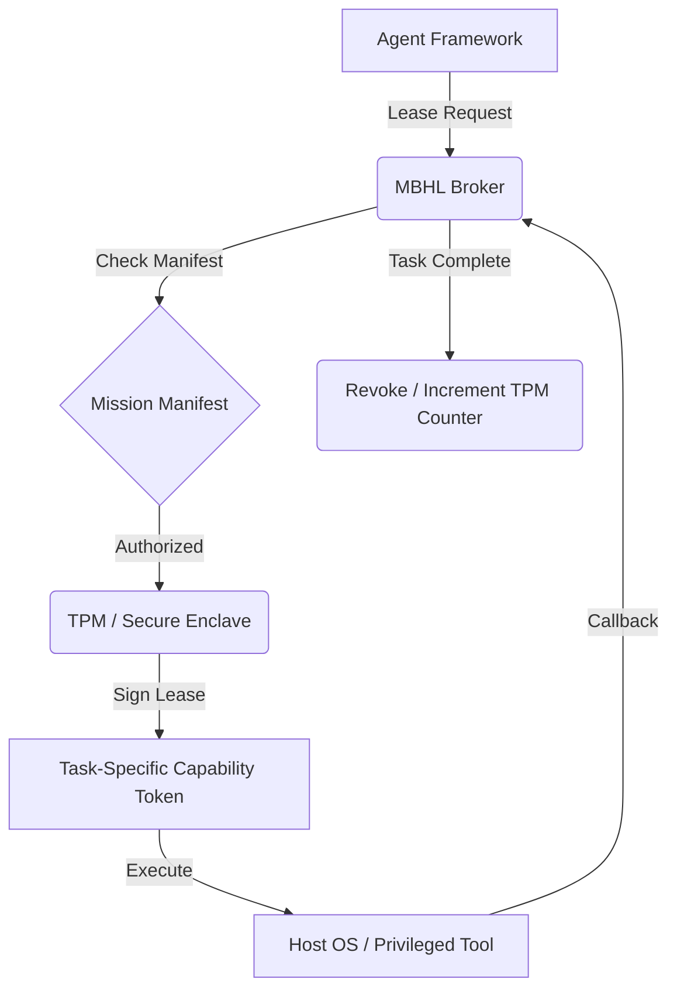

# Design Doc: Mission-Bound Hardware Leases (MBHL)
**Status:** Draft
**Created:** 2026-04-12

## 1. Context and Scope
The current state of AI agent security relies heavily on static "Trust" dialogs or persistent permissions. As evidenced by recent exploits in Claude Code (CVE-2025-59536) and Gemini MCP toolchains (CVE-2026-0755), these models fail when a malicious project-local configuration or a hijacked reasoning loop attempts to execute unauthorized actions before or after the initial trust event.

Mission-Bound Hardware Leases (MBHL) provide a mechanism to tie high-privilege capabilities (e.g., shell access, file writes, API key usage) to a cryptographically signed, task-specific lifecycle. By utilizing Trusted Platform Modules (TPM), we ensure that these leases are hardware-locked and automatically revoked upon task completion, eliminating the risk of "Capability Squatting" and persistent lateral movement in compromised agent swarms.

## 2. Goals & Non-Goals
* **Goals:**
    * **Temporal Isolation**: Capabilities must be issued as time-bound and task-bound leases.
    * **Hardware Root of Trust**: All lease signing and verification must be anchored to a TPM/Secure Enclave.
    * **Deterministic Revocation**: Automated and non-bypassable revocation of privileges upon mission termination.
    * **Auditability**: Provide a non-repudiable audit trail of which mission authorized which specific lease.

* **Non-Goals:**
    * **Tool Logic Validation**: MBHL does not validate the internal logic of a tool, only the authorization to execute it.
    * **Network Gating**: MBHL focuses on host/process level capabilities, not external network egress (handled by the exfiltration-resistant transport).

## 3. Critical User Journey (CUJ)
* **User Persona:** Security-Conscious Developer using Agent Swarms.
* **Primary Goal:** Authorize a subagent to perform a specific refactor involving shell commands without granting permanent terminal access.
* **The Happy Path (Tasks):**
    1. The user defines a "Refactor Mission" with a clear root intent and resource manifest.
    2. MCP Any generates a TPM-signed "Mission Root Token."
    3. The agent requests a shell-execution lease for `refactor_script.sh`.
    4. MBHL Broker verifies the request against the Mission Manifest and issues a sub-millisecond hardware lease.
    5. The tool executes within the lease window.
    6. Once the script exits and the agent reports "Refactor Complete," the TPM monotonic counter increments, effectively revoking the lease for all subsequent requests.

## 4. Design & Architecture
* **System Flow:**

* **APIs / Interfaces:**
    * `POST /v1/lease/request`: Request a task-bound lease.
    * `POST /v1/lease/attest`: Verify a hardware-signed lease fragment.
    * `header: X-MBHL-Mission-ID`: Mandatory header for all leased tool calls.

* **Data Storage/State:**
    * Mission manifests are stored in a hardware-locked SQLite "Blackboard."
    * Active leases are maintained in volatile memory and pinned to active process IDs.

## 5. Alternatives Considered
* **Time-Only Leases**: Rejected because a fixed time window does not prevent an agent from executing multiple unauthorized tasks within that window. Task-binding is essential.
* **Pure Software Signing**: Rejected due to the risk of key exfiltration in compromised environments. Hardware-enclave anchors are the "Gold Standard" for mission-critical sovereignty.

## 6. Cross-Cutting Concerns
* **Security (Zero Trust)**: MBHL implements the principle of least privilege at the temporal layer. Even if an agent is hijacked via prompt injection, its "blast radius" is restricted to the current, user-approved mission.
* **Observability**: All lease requests, issuances, and expirations are logged to the Hardware-Attested Audit Log (HAAL).

## 7. Evolutionary Changelog
* **2026-04-12:** Initial Document Creation.
