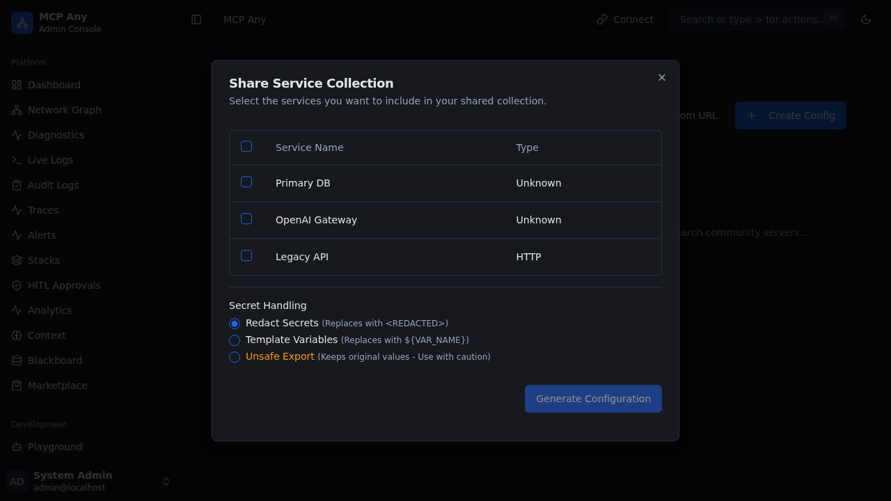

# Design Doc: Plugin Market Ingestion Adapter
**Status:** Draft
**Created:** 2026-03-28

## 1. Context and Scope

The rapid expansion of the OpenClaw plugin market and other third-party agent skill repositories provides swarms with vast new capabilities. However, these external plugins are often unverified and can contain "Invisible" instructions or malicious configuration hooks that lead to command injection and data exfiltration.

MCP Any needs a secure, attested bridge for importing tools from these marketplaces. The Ingestion Adapter provides a standardized workflow for discovery, profiling, and sandboxing marketplace-sourced skills before they are exposed to the agent reasoning engine.

## 2. Goals & Non-Goals
*   **Goals:**
    *   Implement a secure bridge for importing tools from third-party markets (OpenClaw, etc.).
    *   Perform automated "Behavioral Profiling" (using the Ghost Shell) during ingestion.
    *   Mandate structural validation of plugin schemas to detect imperative instruction injection.
    *   Issue hardware-attested "Provenance Receipts" for all imported skills.
*   **Non-Goals:**
    *   Replacing the marketplace's original registry (MCP Any acts as a validating proxy).
    *   Providing a storefront UI (focus is on secure ingestion and policy enforcement).

## 3. Critical User Journey (CUJ)
*   **User Persona:** Security-Conscious Agent Developer
*   **Primary Goal:** Import a "Tavily Search" plugin from OpenClaw and ensure it cannot be weaponized to execute shell commands via prompt injection.
*   **The Happy Path (Tasks):**
    1.  The user provides a marketplace plugin URL or ID to the Ingestion Adapter.
    2.  The Adapter fetches the plugin manifest and schema.
    3.  The **Structural Metadata Sanitizer** scans the schema for forbidden imperative patterns.
    4.  The plugin is loaded into a **Ghost Shell** sandbox for behavioral profiling.
    5.  The Adapter generates a profiling report and suggests a Zero-Trust policy.
    6.  The user reviews the report and signs the **Provenance Receipt** using their hardware key.
    7.  The skill is added to the local discovery bus with an "Attested" badge.

## 4. Design & Architecture
*   **System Flow:**
    `[Marketplace] --> [Ingestion Adapter] --> [Structural Sanitizer] --> [Ghost Shell Profiler] --> [User Attestation] --> [Discovery Bus]`
*   **APIs / Interfaces:**
    *   `POST /v1/ingestion/import`: Initiates the import process for a specific plugin.
    *   `GET /v1/ingestion/report/:id`: Retrieves the behavioral profiling results.
*   **Data Storage/State:** Provenance records and profiling reports are stored in the Blackboard under the `ingestion:provenance` namespace.

## 5. Alternatives Considered
*   **Direct Discovery**: Rejected because it bypasses security profiling and attestation.
*   **Manual Code Review**: Rejected as it doesn't scale with the volume of marketplace updates.

## 6. Cross-Cutting Concerns
*   **Security (Zero Trust):** Ingestion is a "Fail-Closed" process; skills remain quarantined until explicitly attested.
*   **Observability:** Integrated with the `Plugin Market Ingestion Dashboard` for real-time tracking of import status.

## 7. Evolutionary Changelog
*   **2026-03-28:** Initial Document Creation.
