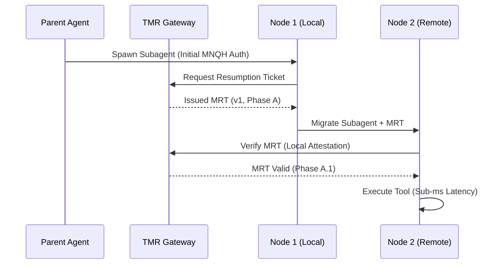

# Design Doc: Temporal Mesh Resumption (TMR) Gateway
**Status:** Draft
**Created:** 2026-07-25

## 1. Context and Scope
As AI agent swarms move from single-node execution to distributed meshes (e.g., OpenClaw SNT), the latency introduced by multi-node coordination and cryptographic handshakes is becoming a primary performance bottleneck. Current multi-node quorum models (MNQH) add significant overhead (200ms+) to every tool call, leading to "Cognitive Stall" in parallel Agent Teams.

The TMR Gateway solves this by acting as a high-speed temporal broker. It utilizes Monotonic Reasoning Timestamps (MRT) to issue time-bound, hardware-attested session resumption tickets. This allows agents to rotate between nodes and resume missions with sub-millisecond overhead, while maintaining the absolute sovereignty of the mission root.

## 2. Goals & Non-Goals
* **Goals:**
    * Facilitate sub-100ms mission resumption across distributed mesh nodes.
    * Enforce MRT-compliant monotonic sequencing for all coordination fragments.
    * Provide hardware-attested (TPM/Secure Enclave) resumption tokens.
    * Neutralize "Reasoning Replay" attacks via unique mission-phase binding.
* **Non-Goals:**
    * Replacing multi-node quorums for initial mission authorization.
    * Managing the physical transport layer (handled by AMT Broker).
    * Storing long-term episodic memory (handled by UEG).

## 3. Critical User Journey (CUJ)
* **User Persona:** Distributed Swarm Architect
* **Primary Goal:** Enable a specialist subagent to migrate from a local workstation to a high-compute remote node without losing context or incurring a full MNQH re-authorization penalty.
* **The Happy Path (Tasks):**
    1. Parent agent initiates a mission and obtains a hardware-attested root lease.
    2. TMR Gateway issues a monotonic resumption ticket (MRT) bound to the current mission phase.
    3. Specialist agent migrates to a remote node, presenting the MRT.
    4. Remote node verifies the MRT via local hardware attestation (no network quorum required for resumption).
    5. Specialist agent resumes reasoning immediately, with state retrieved via UMMB.

## 4. Design & Architecture
* **System Flow:**

* **APIs / Interfaces:**
    * `POST /tmr/v1/issue`: Request a new MRT for a mission branch.
    * `POST /tmr/v1/verify`: Verify and rotate a presented MRT.
    * `MRT Header`: `x-mcpany-tmr: [Token]; phase=[ID]; seq=[Counter]`
* **Data Storage/State:**
    * Ephemeral, kernel-bound memory storage for active MRT sequences.
    * TPM-backed monotonic counters for sequence integrity.

## 5. Alternatives Considered
* **Persistent WebSockets:** Rejected due to connection fragility in distributed/mobile meshes.
* **Global Redis-backed Sessions:** Rejected due to central point of failure and 50ms+ network round-trip latency for state checks.
* **Full MNQH per call:** Rejected due to 200ms+ coordination tax making real-time reasoning impossible.

## 6. Cross-Cutting Concerns
* **Security (Zero Trust):**
    * MRTs are cryptographically restricted to the specific sub-process and mission branch.
    * Any sequence gap or phase mismatch triggers immediate hardware-level revocation.
* **Observability:**
    * Real-time tracking of "Resumption Latency" in the UI Dashboard.
    * Audit logs for all MRT issuance and verification events.

## 7. Evolutionary Changelog
* **2026-07-25:** Initial Document Creation.
