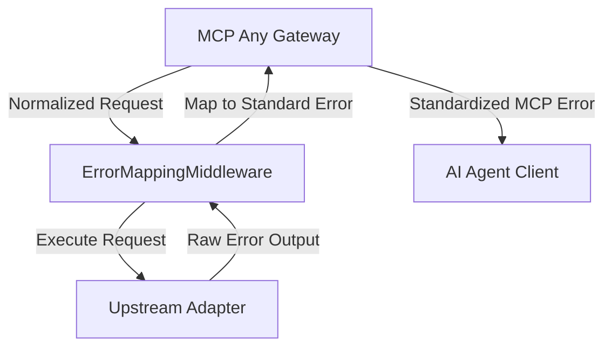

# Design Doc: Universal Error Mapping Middleware
**Status:** Draft
**Created:** 2026-11-02

## 1. Context and Scope
As MCP Any scales to support diverse backend APIs (REST, gRPC, CLI), handling errors consistently across various upstream sources becomes critical. Currently, disparate error formats (HTTP 500, gRPC codes, non-zero CLI exit codes) are passed to AI agents without standardization. This leads to "Error Hallucination," where agents fail to understand the failure mode or attempt incorrect correction strategies.

This middleware will intercept all upstream errors and map them to a standardized semantic MCP error schema, ensuring agents receive actionable and uniform failure signals.

## 2. Goals & Non-Goals
* **Goals:**
    * Intercept arbitrary error outputs from all Adapter types.
    * Standardize errors into a semantic schema (e.g., `INTERNAL_ERROR`, `UPSTREAM_UNAVAILABLE`, `INVALID_ARGUMENTS`).
    * Provide actionable metadata for agentic self-correction.
* **Non-Goals:**
    * Automatically retrying failed calls (handled by Retry Middleware).
    * Modifying successful tool outputs.

## 3. Critical User Journey (CUJ)
* **User Persona:** AI Agent Orchestrator
* **Primary Goal:** Enable a specialist subagent to autonomously recover from a database connection failure without human intervention.
* **The Happy Path (Tasks):**
    1. Agent calls a PostgreSQL tool via a CLI adapter.
    2. The database is down; the CLI exits with code 1 and a verbose stderr.
    3. ErrorMappingMiddleware intercepts the exit code and stderr.
    4. Middleware identifies the failure as a connection issue and maps it to `UPSTREAM_UNAVAILABLE`.
    5. Agent receives a structured error: `{ code: "UPSTREAM_UNAVAILABLE", message: "Database connection failed", retryable: true }`.
    6. Agent identifies the error is retryable and notifies the orchestrator to check connectivity before retrying.

## 4. Design & Architecture
* **System Flow:**

* **APIs / Interfaces:**
    * The middleware will implement the internal `mcpserver.Middleware` interface.
    * A new `ErrorRegistry` will store regex patterns and mapping rules for different adapter types.

## 5. Alternatives Considered
* **Adapter-Level Mapping**: Rejected because it leads to logic duplication across 10+ adapter types.
* **Agent-Side Parsing**: Rejected because it increases prompt tokens and relies on model reasoning, which is prone to hallucination for technical errors.

## 6. Cross-Cutting Concerns
* **Security (Zero Trust):** Ensure that sensitive upstream error details (e.g., internal IP addresses, stack traces) are redacted before standardization.
* **Observability:** Log the raw vs. standardized error mappings for auditing and refinement of mapping rules.

## 7. Evolutionary Changelog
* **2026-11-02:** Initial Document Creation.
