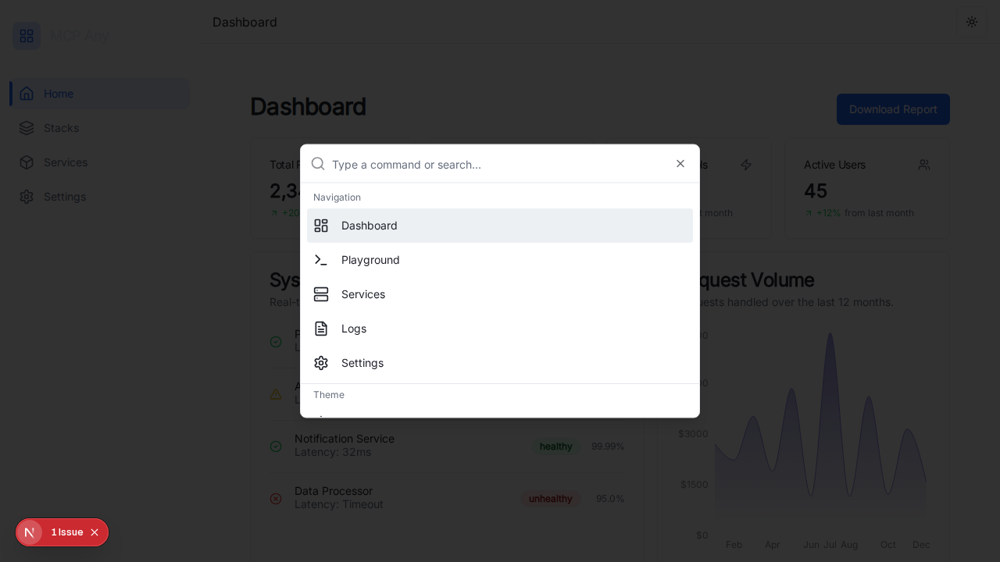

# Global Search (Command Palette)

## Overview

The Global Search feature (accessed via `Cmd+K` or `Ctrl+K`) provides a unified command palette for quick navigation and actions across the MCP Any platform. It mimics the efficiency of tools like Spotlight or standard IDE command palettes, enhancing the "Premium Enterprise" feel.

## Features

-   **Keyboard Shortcut:** Instantly accessible via `Cmd+K` (Mac) or `Ctrl+K` (Windows/Linux).
-   **Navigation:** Quickly jump to key areas:
    -   Dashboard
    -   Playground
    -   Services
    -   Logs
    -   Settings
-   **Theme Switching:** Toggle between Light, Dark, and System themes directly from the palette.
-   **Search:** Filter commands by typing.

## Visuals

## Implementation Details

-   **Component:** `CommandPalette` (`ui/src/components/command-palette.tsx`)
-   **Library:** Built on top of `cmdk` and `shadcn/ui` components.
-   **Integration:** Mounted globally in `RootLayout` (`ui/src/app/layout.tsx`) to ensure availability on every page.
