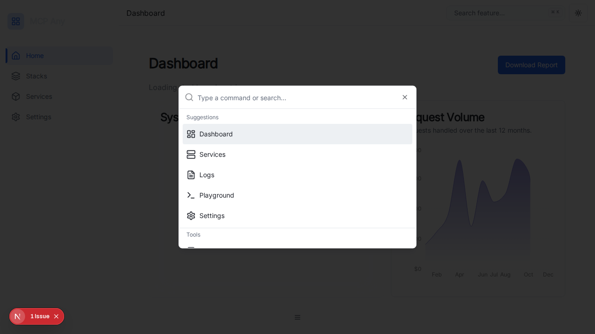

# Global Search (Command Palette)

## Overview

The Global Search (also known as Command Palette) is a powerful navigation and action tool inspired by modern developer interfaces (like Vercel, Linear, VS Code). It allows users to quickly jump to any resource, tool, or page, and perform actions without taking their hands off the keyboard.

## Features

- **Keyboard Shortcut:** Triggered by `Cmd+K` (macOS) or `Ctrl+K` (Windows/Linux).
- **Navigation:** Quickly jump to Dashboard, Services, Logs, Playground, Settings.
- **Tools:** Search and execute registered tools (extensible).
- **Theme Switching:** Toggle between Light, Dark, and System themes directly from the palette.
- **Glassmorphism:** Matches the "Premium Enterprise" aesthetic with blurred backdrops and refined typography.

## Screenshot

## Implementation Details

- **Component:** `ui/src/components/global-search.tsx`
- **Library:** Built on top of `cmdk` and `shadcn/ui` primitives.
- **Integration:** Embedded in the `Layout` to be accessible from any page.

## Usage

1. Press `Cmd+K` or click the "Search" input in the header.
2. Type to filter results.
3. Use `Up/Down` arrows to navigate.
4. Press `Enter` to select an action.
