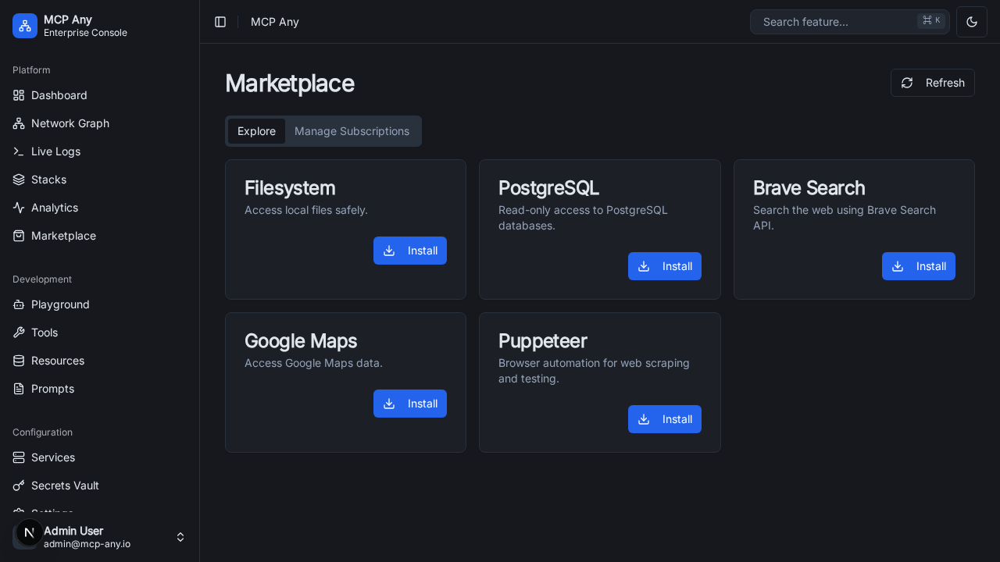

# MCP Marketplace

The MCP Marketplace provides a centralized hub for discovering, installing, and managing MCP services. It simplifies the process of finding popular upstream services and keeping them up-to-date.

## Features

- **Explore Services**: Browse a curated list of popular MCP services.
- **One-Click Install**: Install services (register them) directly from the marketplace UI.
- **Manage Subscriptions**: Subscribe to service collections (e.g., "Popular Services", "Company Internal").
- **Sync**: Keep your service definitions updated with the latest changes from the subscription source.

## Getting Started

1. Navigate to the **Marketplace** tab in the sidebar (Shopping Bag icon).
2. The **Explore** tab shows all services available from your active subscriptions.
3. Click **Install** on any service to register it.
4. Once installed, the service appears in your **Services** list and is ready to use.

## Managing Subscriptions

You can manage your subscriptions in the **Manage Subscriptions** tab:
- **Sync**: Fetches the latest service list from the subscription source.
- **Active/Inactive**: Toggle subscriptions to hide/show their services in the Explore tab.

## Default Subscriptions

By default, MCPAny comes with a "Popular MCP Services" subscription enabled, which provides access to common services like:
- **Filesystem**: Access local files safely.
- **PostgreSQL**: interact with databases.
- **Brave Search**: Web search capabilities.
- **Google Maps**: Location services.
