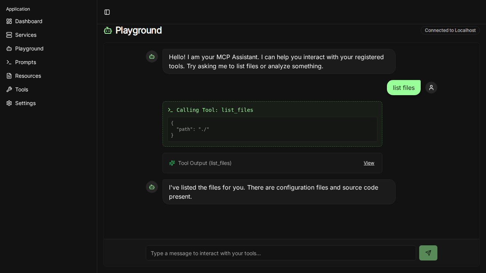

# MCP Any Playground

The Playground is a new feature that allows users to interact with their configured MCP tools directly from the web interface.

## Features

-   **Interactive Chat Interface**: A familiar chat-like experience to send prompts to the assistant.
-   **Tool Visualization**: See exactly when a tool is called, with what arguments, and what the output is.
-   **Mocked Backend**: Currently demonstrates the UI flow with simulated tool execution delays and responses.
-   **Global Navigation**: Access the playground easily from the new application sidebar.

## Screenshot

## Usage

1.  Navigate to the **Playground** tab in the sidebar.
2.  Type a request in the input field (e.g., "list files").
3.  The assistant will process the request, showing any tool calls and their results.
