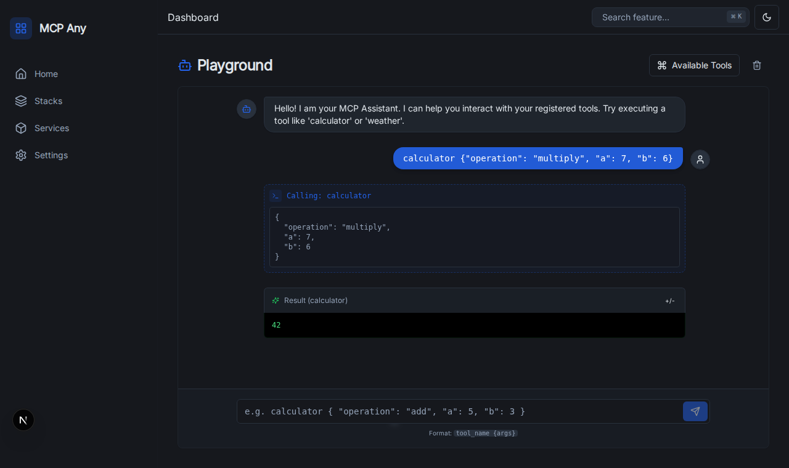

# Interactive Playground

The Interactive Playground provides a powerful, chat-based interface for developers to test and debug their registered MCP tools directly within the MCPAny dashboard.

## Features

- **Real-time Tool Execution:** Directly execute tools registered in the system.
- **Natural Language & JSON Support:** Interact with tools using structured JSON commands.
- **Tool Discovery:** Built-in sidebar to explore available tools and their schemas.
- **Visual Feedback:** Clear success/error indicators and syntax-highlighted results.

## Usage

1. Navigate to the **Playground** tab in the sidebar.
2. Browse available tools by clicking the "Available Tools" button.
3. Type a command in the input box using the format: `tool_name {"arg": "value"}`.
   - Example: `calculator {"operation": "add", "a": 10, "b": 5}`
4. View the result in the chat stream.

## Screenshot

## Implementation Details

The playground connects to the `/api/v1/execute` endpoint, which proxies requests to the configured backend or executes built-in system tools (like `calculator`, `echo`, `system_info`).
