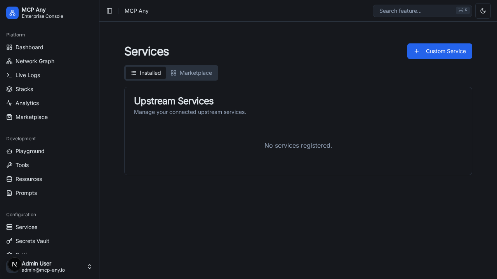

# Service Types

MCP Any supports a wide range of service types to expose various backends as MCP tools.

## Supported Service Types

*   **gRPC**: Register services from `.proto` files or by using gRPC reflection.
*   **OpenAPI**: Ingest OpenAPI (Swagger) specifications to expose RESTful APIs as tools.
*   **HTTP**: Expose any HTTP endpoint as a tool.
*   **GraphQL**: Expose a GraphQL API as a set of tools.
*   **Stdio**: Interact with command-line tools.
*   **MCP-to-MCP Proxy**: Proxy and re-expose tools from another MCP Any instance.
*   **WebSocket**: Connect to WebSocket endpoints.
*   **WebRTC**: Connect via WebRTC.
*   **SQL**: (Beta) Connect to SQL databases and expose queries as tools.
*   **Bundle**: Register a bundled MCP service (e.g. a zip file containing a Python script and dependencies).

## Configuration

Services can be configured via the configuration file or through the UI.

### UI Configuration

You can register, edit, and manage services directly from the **Services** page in the UI:

1. Click **Services** in the sidebar.
2. Use the **Register Service** button to add a new service.
3. Click on a service to view details, then click **Edit Config** to modify it.

### Configuration File

Service types are configured in the `upstream_services` section of the configuration file.

See `docs/reference/configuration.md` for detailed configuration options.
