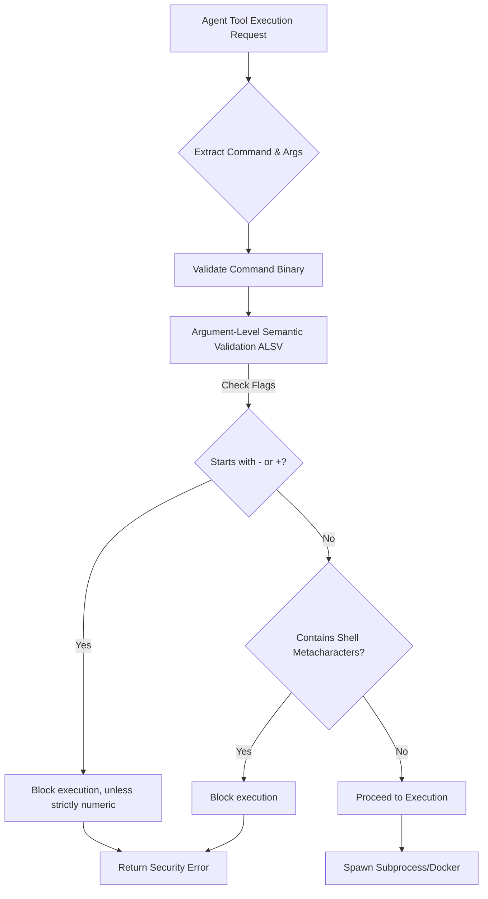

# Architectural Evolution: Argument-Level Semantic Validation (ALSV)
**Status:** Approved
**Created:** 2026-03-24 (Simulated current date based on context)

## 1. Context and Scope
The emergence of "Settings-as-Shell" exploits and allowlist bypass vulnerabilities in tools like OpenClaw (CVE-2026-32000, CVE-2026-22169) confirm that the "Universal Agent Bus" must protect against sophisticated shell injections. Specifically, attackers exploit shell fallbacks and dangerous command flags (e.g. `--compress-program`) even for tools that appear explicitly allowlisted. Simple binary authorization is no longer sufficient; we need granular, semantic validation of the arguments passed to those binaries.

## 2. Goals & Non-Goals
* **Goals:**
    *   Neutralize the shell-fallback and allowlist bypass vulnerabilities.
    *   Mandate Argument-Level Semantic Validation (ALSV) for all command-based tools.
    *   Perform real-time, semantic analysis of command arguments.
    *   Block unauthorized flags (starting with `-` or `+`) by default, and block dangerous shell metacharacters inside arguments.
* **Non-Goals:**
    *   To implement a complete, semantic understanding of every possible shell utility in existence. The approach relies on strict allow-by-default limitations instead.

## 3. Core Logic
MCP Any integrates ALSV into the Pre-Hook phase of its command adapter logic, fundamentally operating in `server/pkg/tool/types.go` during input parsing and validation.

### Technical Details
*   **Flag Blocking**: Any argument prefixed with `-` or `+` is immediately blocked. This strictly disables dangerous fallback capabilities in tools that might interpret these parameters as flags rather than positional input. An exception is made exclusively for negative or positive numeric values (e.g., `-1.5`, `+10`).
*   **Shell Metacharacter Validation**: We restrict the character set passed via arguments. Characters like `$`, `&`, `|`, `;`, and backticks (`` ` ``) are explicitly forbidden to prevent argument injection from breaking out into a shell context.
*   **Integration with Existing Scanners**: ALSV serves as a final, strict safety net that runs in conjunction with existing shell injection validators, ensuring defense-in-depth.

## 4. Impact
By mandating ALSV, MCP Any closes a significant gap in Agentic Security, where otherwise benign commands can be coerced into arbitrary code execution. This solidifies MCP Any's position as the leading Zero Trust discovery and coordination hub for AI Agents.
