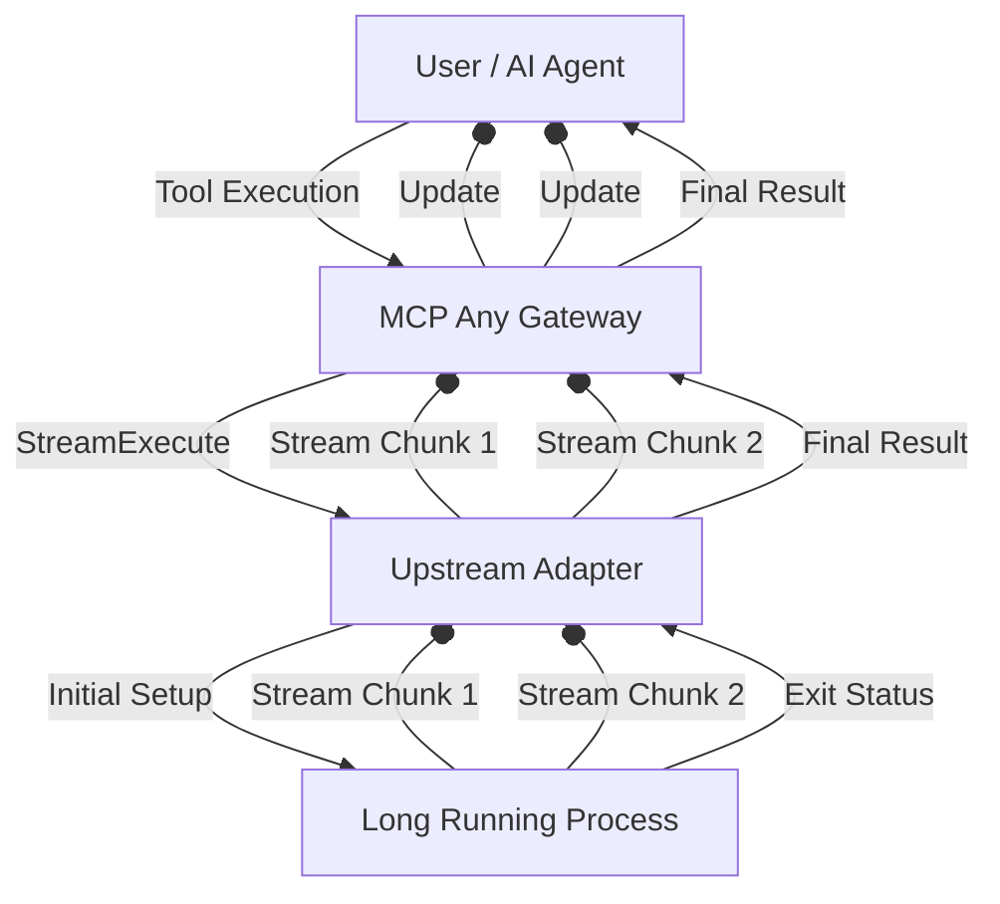

# Strategic Evolution: 2026-03-29

## Focus: Real-Time Telemetry and Streaming Execution Results

**Context**: As autonomous swarms perform deeper and more long-running tasks, waiting for an entire tool execution to complete before receiving output causes "Cognitive Stall" for the user and parent agents. Long-running shell commands, streaming LLM outputs, or continuous metric gathering require a mechanism to stream results incrementally rather than returning a monolithic block at the end. Current architecture buffers output, leading to delayed feedback loops.

**Strategic Pivot**:
- **Streaming Tool Execution**: MCP Any will evolve to support real-time streaming of tool outputs. We will introduce a streaming interface that allows tools to emit progress chunks, enabling faster feedback for interactive UI and downstream agents.
- **Incremental Context Updates**: By streaming tool execution, parent agents can dynamically adjust or abort long-running tasks if early streaming results deviate from the mission root, mitigating context pollution early.

## Core Logic

The core logic introduces an `StreamTask` method in the `AgentFramework` interface which accepts a channel for streaming `TaskResult` chunks back to the Gateway.

This ensures that partial results can be streamed.
