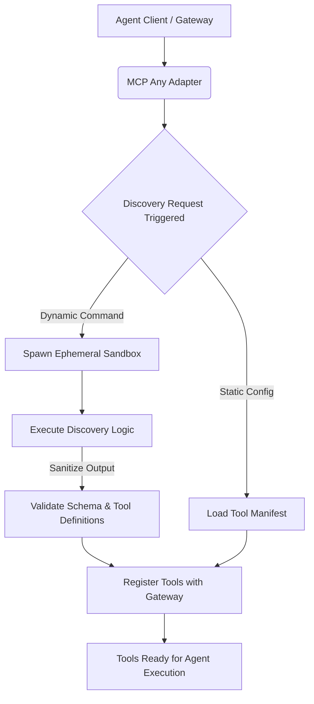

# Strategic Evolution: Discovery-Phase Sandbox Isolation

**Date:** 2026-03-29
**Author:** Principal Software Engineer & Core Systems Lead
**Focus:** Horizontal Coordination & Discovery-Phase Sovereignty

## Context
The emergence of "Agent Teams" in horizontal swarms and the discovery of "Settings-as-Shell" exploits in agentic CLIs confirm that the "Universal Agent Bus" must now move beyond simple tool proxying. We must protect the **discovery phase** itself and provide **non-blocking coordination** for parallel teammates. As agents move from linear sessions to horizontal teammate meshes, the security frontier is no longer just the "tool," but the **Inbox** where agents coordinate and the **Manifest** that defines their discovery.

## Core Logic: Discovery-Phase Sandbox Isolation
MCP Any treats all discovery-time execution (e.g., `tools.discoveryCommand`) as high-risk events. We are implementing an "Isolated Discovery Environment" where discovery logic is executed in an ephemeral, zero-trust sandbox before any tool is exposed to the primary agent. This prevents startup-time RCE and "Ghost-Execution" exploits by limiting the blast radius of any compromised discovery script.

### Mermaid Diagram: Gateway to Adapters

## Strategic Impact
1. **Zero-Trust Discovery:** Prevents malicious payloads embedded in discovery scripts from compromising the host during the initial handshake.
2. **Deterministic Boot:** Ensures the capability manifest generated is isolated, repeatable, and explicitly scoped.
3. **Resiliency:** A compromised discovery command cannot "hijack" the underlying execution environment before the agent has even begun reasoning.
