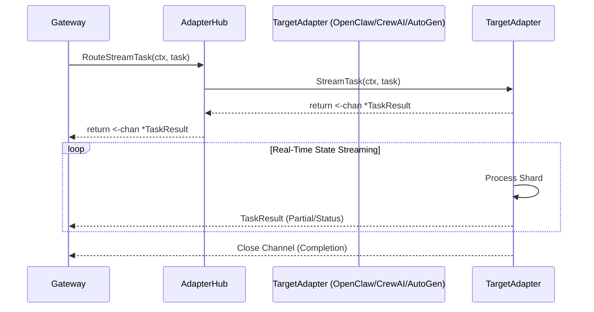

# Streaming Architectural Evolution

## Context & Motivation

The emergence of "Dynamic Context Sharding Adapter" (P0) and the increasing requirement for real-time contextual awareness in autonomous swarms dictate that simple request/response RPC paradigms are no longer sufficient. Agents need "Granular State Streaming" to synchronize task-bound context fragments without global state locks, neutralizing "Mailbox Lock" bottlenecks.

The current `AgentFramework` interface limits interaction to a synchronous `HandleTask(ctx, task) -> result` model. To evolve MCP Any into the universal adapter for high-density, real-time agent teams, we must natively support task streaming.

## Core Logic

We are introducing the `StreamTask` method to the `AgentFramework` interface. This allows an adapter to push granular `TaskResult` events as they are generated over a Go channel.

The new capability will require:
1.  **Interface Evolution:** Add `StreamTask(ctx context.Context, task *Task) (<-chan *TaskResult, error)` to `AgentFramework`.
2.  **Hub Support:** Add `RouteStreamTask(ctx context.Context, task *Task) (<-chan *TaskResult, error)` to `AdapterHub`.
3.  **Adapter Implementation:** All existing adapters (`OpenClawAdapter`, `CrewAIAdapter`, `AutoGenAdapter`) must implement the new method. They will initially simulate streaming by pushing single or multiple checkpoints before closing the channel.

## Architectural Flow

The following Mermaid diagram maps the streaming flow from the Gateway (via Hub) down to the Adapters:

## Considerations

- **Scalability:** Streaming relies on unbuffered or lightly buffered channels to ensure zero-latency backpressure.
- **Security:** Shards must still be attested (HACA integration) before ingestion, though that layer will ride on top of this transport.
- **Rigor:** Implementation follows Google-standard interface compliance and error handling, ensuring no goroutine leaks.
