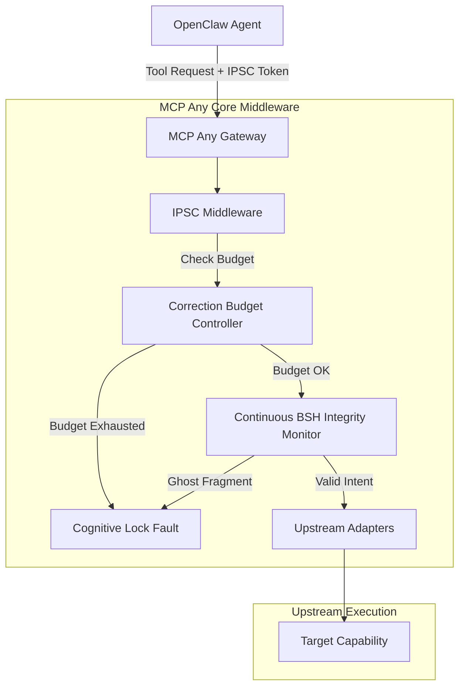

# Architectural Evolution: Intent-Preserving Self-Correction (IPSC)

**Date:** 2026-03-30
**Focus:** Cognitive Lock Mitigation & Continuous State Integrity

## Context
With the release of OpenClaw v2.6, "Autonomous Self-Correction" has introduced a systemic failure mode dubbed **"Cognitive Lock."** In this scenario, specialized agents enter infinite loops of correcting each other's refinements, resulting in catastrophic token and compute exhaustion. Additionally, security researchers have demonstrated the **"Ghost Fragment Mutation" (GFM)** attack, where malicious payload fragments are injected during the late-binding phase of Binary State Handoffs (BSH), bypassing initial Proof-of-Intent (PoI) validations.

## Strategic Pivot
- **UACO v2.1 IPSC Middleware**: To break "Cognitive Lock," MCP Any will implement the UACO v2.1 Intent-Preserving Self-Correction protocol. This introduces a strict "Correction Budget" bound to the active intent session. Agents exceeding this budget will trigger a mandatory "Intent Re-Verification" before further tool calls are permitted.
- **Continuous BSH Integrity Monitor**: To neutralize GFM attacks, we are augmenting the BSH transport layer with real-time integrity checks. State handoffs must maintain semantic alignment with the established intent tree, forcing all self-correction modifications to be explicitly validated against the parent PoI.
- **Correction Budget Controller**: A resource management tier to allocate, track, and enforce token/compute constraints specifically mapped to refinement operations.

## Core Logic: IPSC Middleware

The Intent-Preserving Self-Correction (IPSC) Middleware acts as a recursive intent governor. When an agent enters a self-correction loop (detected via UACO headers or repetitive tool call patterns), the middleware intercepts the operation and decrements the session's Correction Budget. If the budget is exhausted, the middleware blocks the execution with a `CognitiveLockDetected` error, forcing the agent (or a supervisor) to re-verify the original intent or explicitly allocate a new budget.

### Request Flow
1. **Client Execution Request:** An agent issues a tool execution request to the MCP Any Gateway.
2. **IPSC Interception:** The IPSC Middleware checks the request for self-correction patterns or UACO v2.1 IPSC tokens.
3. **Budget Evaluation:** The middleware evaluates the agent's current Correction Budget.
4. **Enforcement:**
   - If the budget is > 0, the budget is decremented, and the request is passed downstream.
   - If the budget is 0, the middleware rejects the request, mandating an Intent Re-Verification.
5. **State Integrity Validation:** Concurrently, the Continuous BSH Monitor scans the request payload for un-attested Ghost Fragments that diverge from the established Proof-of-Intent.
6. **Execution/Rejection:** Validated requests proceed to the upstream adapters; violations return an immediate policy fault.

## Component Diagram

