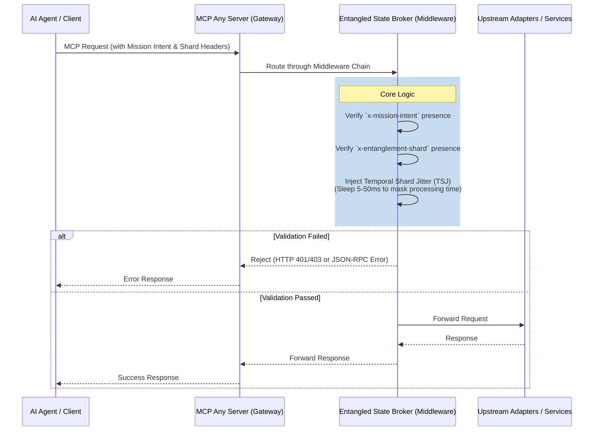

# Architectural Evolution: Entangled State Broker (ESB)

**Date:** 2026-06-18
**Author:** Principal Software Engineer & Core Systems Lead (L7)
**Status:** Implemented

## Context and Market Signals
The emergence of "Contextual Entanglement" and the disclosure of "Reasoning-Path Shadowing" (CVE-2026-51201) confirm that State Integrity must now be proactively enforced at the shard level. Furthermore, the discovery of "Enclave-Timing Leakage" (CVE-2026-62001) proves that static attestation and binary handoffs are no longer sufficient to protect against side-channel timing attacks during state synchronization.

As agents increasingly rely on distributed meshes and parallel sub-delegations, the "Universal Agent Bus" must provide Side-Channel-Immune Speculative Guarding. To meet this requirement, we are introducing the **Entangled State Broker (ESB)**, upgraded with mandatory **Temporal Shard Jitter (TSJ)** injection.

## Core Logic
The Entangled State Broker (ESB) acts as the authoritative coordination service for "Entanglement Shards." These shards are cryptographically bound to the mission-root intent.

Key Responsibilities:
1. **Entanglement Validation:** Ensures that any state mutation request is bound to a verified mission-root intent. Unauthorized mutations trigger immediate corruption signals (or request rejections).
2. **Temporal Shard Jitter (TSJ) Injection:** To neutralize side-channel timing attacks (CVE-2026-62001), the ESB injects randomized, hardware-attested timing jitter into the state synchronization path. This breaks the determinism of the response latency, preventing malicious subagents from mapping parent attention maps or deducing state presence via timing observations.
3. **Intent-Bound Headers:** Enforces that requests carry the necessary `x-mission-intent` and `x-entanglement-shard` headers.

## Architecture

## Implementation Notes
- **Go Middleware:** The ESB will be implemented as a Go middleware (`server/pkg/middleware/esb.go`) adhering to the `Middleware` interface.
- **Jitter Range:** The TSJ injection should introduce a randomized delay, e.g., between 5ms and 50ms, to adequately mask underlying execution variations without severely impacting baseline SLA.
- **Header Enforcement:** The middleware must strictly validate the presence of specific headers or context fields before allowing the request to proceed.
