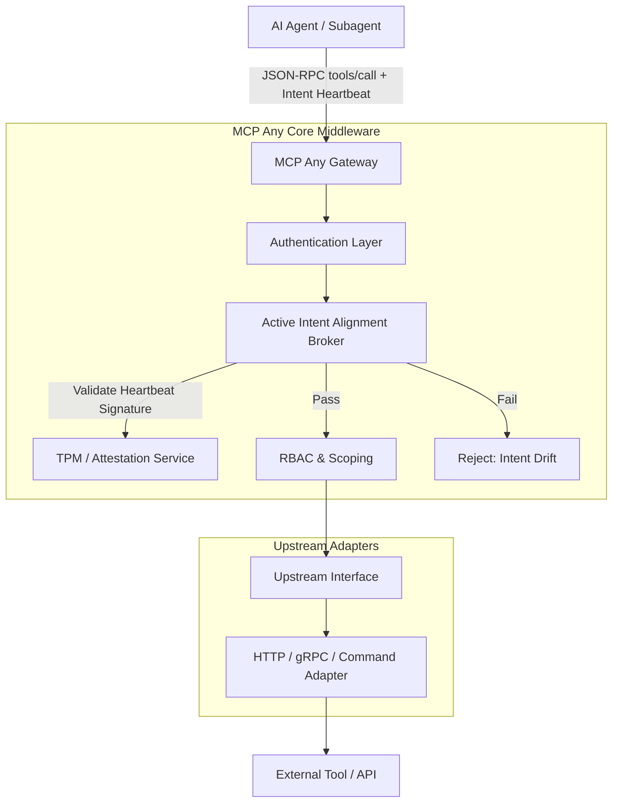

# Active Intent Alignment (AIA) Broker: Architectural Evolution
**Date:** 2026-06-18

## 1. Executive Summary
Following the release of OpenClaw v3.2.1 and the introduction of "Mission-Bound Heartbeats", we are evolving MCP Any to natively support the Active Intent Alignment (AIA) Broker. The AIA Broker solves the "Intent Drift" problem by implementing a hardware-attested, high-frequency synchronization mechanism that ensures specialist subagents remain strictly tethered to the "Mission Root" intent.

## 2. Market Context & Gap Analysis
As deep swarms scale horizontally, specialist agents (e.g., executing Python tools or searching databases) can drift from the parent agent's original goal due to isolated reasoning loops. Simply enforcing transport-layer security or capability scoping is insufficient; the *semantic intent* must be continually attested. The AIA Broker addresses this by demanding high-frequency "Intent Heartbeats" alongside every tool call in the context window.

## 3. Core Logic
The Active Intent Alignment (AIA) Broker functions as a core security middleware injected at the gateway level.

1.  **Session Initialization:** When a swarm is initiated, the master agent creates a `MissionRoot` comprising a cryptographic hash of the primary goal and a `HardwareAttestationToken`.
2.  **Subagent Spawning:** Subagents inherit an `IntentBoundToken` tied to the `MissionRoot`.
3.  **High-Frequency Heartbeat Validation:** Every JSON-RPC `tools/call` made by a subagent must include an `x-intent-heartbeat` header (or request parameter) that signs the tool invocation against the `IntentBoundToken`.
4.  **Semantic Drift Analysis:** The AIA Broker verifies the cryptographic signature. If a subagent attempts a tool call without a valid heartbeat, or the signature does not match the mission root hash, the call is rejected with a `403 Intent Drift Detected` error.

## 4. Architecture Diagram

## 5. Implementation Plan
- Implement `ActiveIntentAlignmentMiddleware` in `server/pkg/middleware/`.
- The middleware will parse the `x-intent-heartbeat` from request metadata or parameters.
- If missing or invalid, it short-circuits with a standardized error.
- Integrate into the default middleware chain, supporting an opt-in or strictly enforced P0 configuration.
