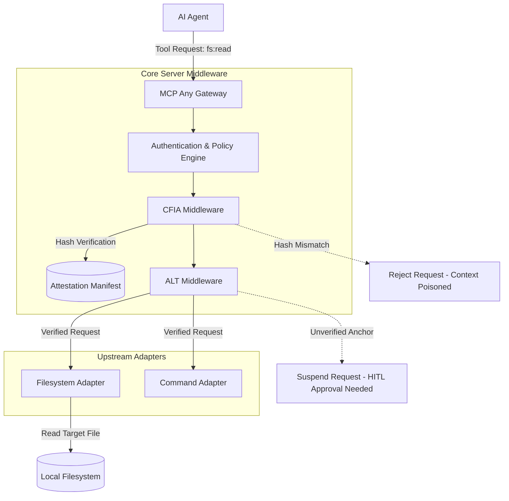

# Evolution: Context-File Integrity Attestation (CFIA) and Attention-Locked Tooling (ALT)

**Date**: 2026-06-20
**Status**: Accepted
**Author**: Principal Software Engineer & Core Systems Lead (L7)

## Overview

The shift toward local zero-trust and mesh-resident agent coordination has exposed new vulnerability surfaces in how agents consume local context. The discovery of "Deceptive Context Injection" (e.g., malicious modifications to project-local `GEMINI.md` or `.claude/settings.json` files via upstream git pulls) necessitates a fundamental change in how MCP Any processes context files.

This document outlines the architectural evolution to support **Context-File Integrity Attestation (CFIA)** and **Attention-Locked Tooling (ALT)**.

## Strategic Motivation

1.  **Deceptive Context Injection**: Malicious actors can subtly alter project-local natural language context files. When an agent reads these files, the altered context can subtly shift its reasoning, leading to unauthorized actions or exfiltration (Context-Hijacking).
2.  **Unverified High-Risk Actions**: Even with granular scopes, high-risk tools (e.g., `fs:write`, `cmd:exec`) can be executed if the agent's intent has been successfully hijacked by poisoned context.

To counter these threats, we must mandate hardware-attested, hash-based signatures for all local context files (CFIA) and cryptographically lock high-risk tool calls to user-verified reasoning anchors (ALT).

## Core Logic

### Context-File Integrity Attestation (CFIA)

The CFIA middleware acts as a gatekeeper for any tool that reads local files (e.g., the Filesystem adapter reading `GEMINI.md`).
1.  **Intercept**: The middleware intercepts read requests for configured sensitive context files.
2.  **Hash Verification**: It calculates the cryptographic hash (e.g., SHA-256) of the requested file's content.
3.  **Attestation Check**: It compares the calculated hash against a known-good, hardware-attested manifest of approved context file signatures.
4.  **Enforcement**: If the signature does not match or is absent, the middleware blocks the read operation, neutralizing the deceptive context before it enters the agent's attention window.

### Attention-Locked Tooling (ALT)

The ALT middleware interdicts high-risk tool calls that are deemed to be driven by un-attested context.
1.  **Intent Tracking**: It leverages the existing Active Intent Alignment (AIA) Broker to track the agent's mission-root intent.
2.  **Anchor Verification**: Before executing a high-risk tool, ALT verifies that the reasoning trace leading to the call is anchored in user-verified, CFIA-attested context.
3.  **Cryptographic Lock**: If the reasoning provenance cannot be traced back to an attested anchor, the call is locked (suspended) pending explicit user approval via the HITL Middleware.

## Architectural Flow

## Implementation Plan

1.  **Phase 1: CFIA Middleware**: Implement the CFIA middleware in `server/pkg/middleware/cfia.go`. This will include configuration for sensitive files and the expected hash manifest.
2.  **Phase 2: Integration**: Integrate CFIA into the Service Registry's middleware chain for appropriate tool calls.
3.  **Phase 3: ALT Foundations**: Lay the groundwork for ALT by extending the execution request context with attestation flags passed down from CFIA.
