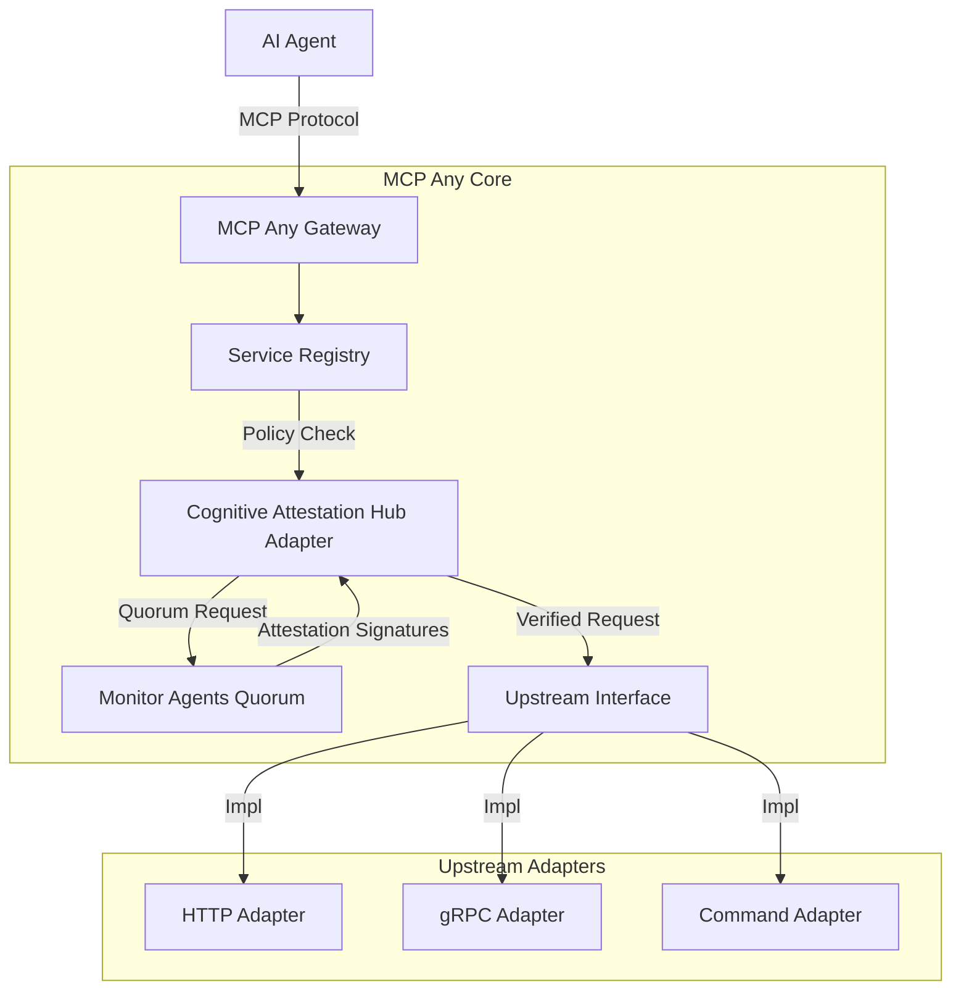

# Architectural Evolution: Cognitive Attestation Hub (CAH) Adapter

**Date:** 2026-06-30
**Focus:** Cognitive Attestation & Priority-Aware Coordination

## Context
The release of OpenClaw v3.3.0's "Cognitive Attestation Hub" and the disclosure of "Attention-Splicing" (CVE-2026-91023) prove that mission-root sovereignty now requires **Collective Cognitive Consensus** and **Interrupt-Aware State Sharding**. As teams become more horizontal and parallel, infrastructure must manage not just the flow of data, but the **Priority of Intent** and the **Integrity of Attention**.

## Strategic Pivot
- **Cognitive Attestation Hub (CAH) Adapter**: MCP Any will evolve to act as the authoritative bridge for OpenClaw's CAH standard. We will implement standardized consensus hooks that allow swarms to reach a hardware-attested quorum on reasoning integrity before blackboard commits.
- **Priority-Aware Mailbox Sharding (PAMS)**: To neutralize coordination stalls, we are upgrading the AMS middleware to support PAMS. This allows "Urgent Interrupt" signals to bypass standard sharding locks, ensuring that safety-critical intent corrections reach teammates instantly.
- **Attention-Splicing Firewall (ASF)**: Supporting the "Attention-Density" pillar, we are introducing ASF. This layer will monitor the semantic entropy of "Noise fragments" and interdict instructions that attempt to hijack the parent attention window via high-confidence stylistic mimicry.
- **Leased Mission Persistence (LMP)**: To address "Teammate Rotation Fatigue," we are introducing LMP. We will broker hardware-locked, time-bound mission leases that allow horizontal teammates to resume contexts with minimal re-attestation overhead, maintaining security without the latency tax of full hardware signatures at every rotation.

## Core Logic: CAH Adapter

The Cognitive Attestation Hub (CAH) Adapter acts as the central arbiter for verifying that agent interactions maintain mission-root sovereignty and semantic integrity. When an agent proposes a state mutation or requests access to a resource, the CAH intercepts the request. It then interacts with a decentralized quorum of security and policy validation agents to collect cryptographically bound approval signatures. The request is only permitted to proceed if the quorum reaches the configured consensus threshold, ensuring that no single agent can unilaterally compromise the system.

### Request Flow
1. **Client Request:** An agent issues a JSON-RPC request to the MCP Any Gateway.
2. **Interception:** The CAH Adapter intercepts the request prior to upstream routing.
3. **Quorum Initiation:** The CAH initiates a consensus gathering process by requesting signatures from the configured monitor agents.
4. **Validation:** The monitor agents validate the request against hardware-attested policies and mission-root constraints.
5. **Consensus Evaluation:** The CAH aggregates the responses and evaluates them against the dynamic quorum threshold. The quorum is met as soon as the required number of positive signatures is reached, enabling fast-path execution.
6. **Execution:** If the threshold is met, the request is passed to the relevant Upstream Adapter for execution. If rejected, a policy violation error is returned.

## Component Diagram

