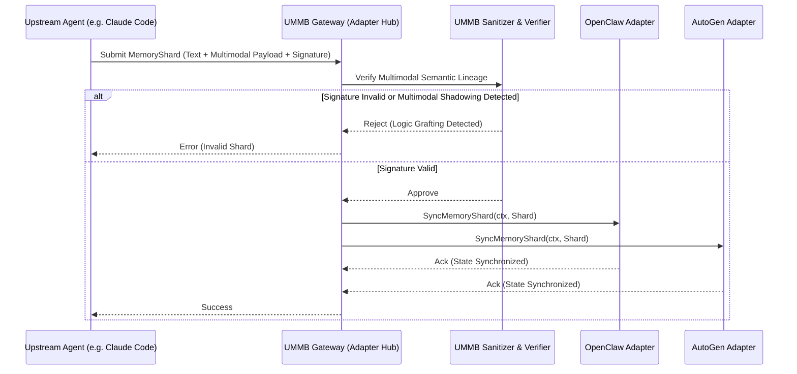

# Architectural Evolution: Universal Multimodal Memory Bus (UMMB)

**Date:** 2026-07-03
**Author:** Lead Systems Architect (L7)
**Status:** Approved for Implementation

## Context and Strategic Need

The transition from single-agent linear execution to horizontal, heterogeneous swarms (e.g., Claude Code Agent Teams, OpenClaw specialist swarms) has revealed critical bottlenecks in memory and state sharing. Our research and market signals (2026-07-01 framework ingestion research and 2026-07-02 market sync) emphasize that current ecosystems suffer from "Context Fragmentation" and "Multimodal Shadowing."

Specifically, agents utilizing non-textual reasoning traces (e.g., SVG-based UI plans, Audio metadata) are vulnerable to "Multimodal Logic Grafting," where unauthorized reasoning instructions are appended to shared state shards. To neutralize this, we must protect the semantic integrity of the mission root across disparate frameworks and multimodal inputs.

## Core Logic

The Universal Multimodal Memory Bus (UMMB) introduces hardware-attested, intent-pinned memory shards that synchronize state across agent frameworks. It performs real-time, hardware-attested sanitization of multimodal traces (audio/video/SVG) to prevent context smuggling and intent drift.

The logic flow ensures that:
1. When an agent produces a `MemoryShard`, it must include a cryptographic signature of the multimodal payload.
2. The Gateway (Adapter Hub) verifies the signature against the mission root.
3. The verified `MemoryShard` is then synchronized to the recipient Agent Framework via the `SyncMemoryShard` interface method.
4. Any framework receiving the shard is guaranteed that the multimodal trace has not been tampered with or "shadowed" by malicious subagents.

## Architecture Flow

The following Mermaid diagram maps the flow of a `MemoryShard` from the Gateway to the Adapters:

## Implementation Interfaces

We are evolving the `AgentFramework` interface to support this feature natively.

*   `MemoryShard`: A new struct encapsulating text content, multimodal payload (e.g., SVG/Audio metadata), and a hardware-attested signature.
*   `SyncMemoryShard`: A new method added to the `AgentFramework` interface to ingest a `MemoryShard` and synchronize it with the framework's internal context.
