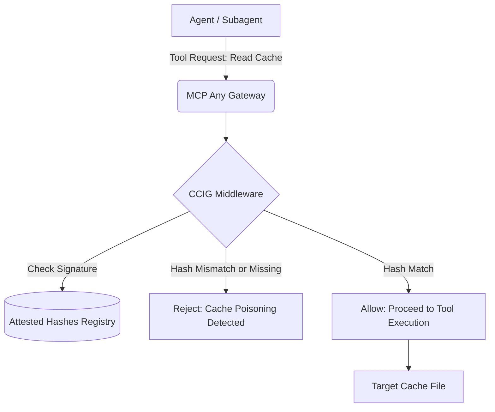

# CI/CD Cache Integrity Guard (CCIG)

## 1. Overview
**Date**: 2026-07-09
**Author**: Principal Software Engineer & Core Systems Lead (L7)
**Status**: Draft
**Strategic Alignment**: [2026-07-07] AI-Native CI/CD Protection & Automated Compliance Attestation

### Objective
The CI/CD Cache Integrity Guard (CCIG) is an authoritative validator for agent-accessible build caches. As AI agents increasingly operate within sensitive build pipelines (as seen in the Cline CI/CD cache poisoning exploit), infrastructure must move beyond simple tool-gating. CCIG requires cryptographic signatures for all cache fragments to ensure that "Agentic Social Engineering" cannot poison the mission-root supply chain.

## 2. Architecture
CCIG operates as a pre-execution security middleware within the Universal Agent Bus (MCP Any). It intercepts any tool requests that interact with the build cache (e.g., `fs:read`, `cache:restore`), validates the cryptographic signature of the cache fragment against a known-good attested hash, and either allows or forcefully rejects the action.

### Mermaid Diagram



## 3. Core Logic
The CCIG middleware will be configured with a list of target tools (e.g., `fs:read`, `cache:restore`) and a map of expected, hardware-attested SHA-256 hashes for specific cache file paths.

1. **Interception**: When a tool request is received, CCIG checks if the tool is in the `TargetTools` list.
2. **Argument Extraction**: CCIG extracts the target file path from the request arguments (defaulting to the `path` argument).
3. **Registry Lookup**: CCIG looks up the target path in the `AttestedHashes` registry. If the path is not registered, CCIG allows the request to proceed (fail-open for non-cache files, or fail-closed based on stricter future policies; currently opting for targeting specific paths).
4. **Cryptographic Validation**: CCIG reads the file from the filesystem and calculates its SHA-256 hash.
5. **Enforcement**:
   - If the calculated hash matches the attested hash, the request is allowed.
   - If the hash mismatches or the file cannot be read, the request is rejected with a distinct "Supply Chain Poisoning Detected" error.

## 4. Interfaces and Implementation
*   **Location**: `server/pkg/middleware/ccig.go`
*   **Dependencies**: Requires `crypto/sha256` and integration with the `tool.ExecutionRequest` and `tool.ExecutionFunc` types.

```go
type CCIGConfig struct {
    Enabled        bool              `json:"enabled"`
    TargetTools    []string          `json:"target_tools"`
    AttestedHashes map[string]string `json:"attested_hashes"`
    ArgumentName   string            `json:"argument_name"`
}
```

The middleware will implement the standard `Execute` method pattern used across the MCP Any codebase to chain execution.
