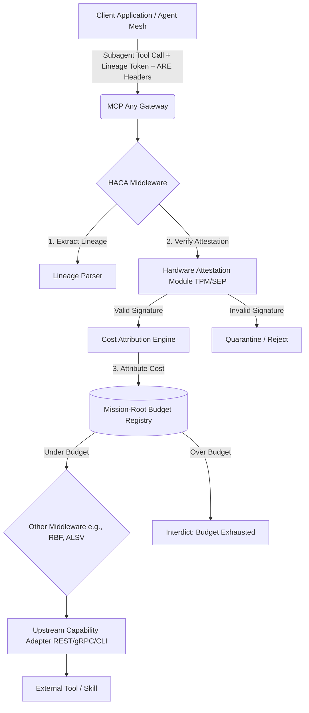

# Architectural Evolution: Hardware-Attested Cost Attribution (HACA)

**Date**: 2026-07-11
**Author**: Principal Software Engineer & Core Systems Lead (L7)
**Status**: Implemented

## Context & Market Signals

The emergence of "Economic Squatting" and "Reasoning-Budget Hijacking" in high-density horizontal swarms (e.g., Claude Code Agent Teams) confirms that simple token counting and transport-layer security are no longer sufficient. As swarms scale, subagents from disparate frameworks (OpenClaw, AutoGen) interact within shared meshes. If token usage and compute time are not cryptographically attributed to specific mission-root branches, malicious or malfunctioning subagents can exhaust the parent's budget.

The industry pivot towards **Hardware-Attested Cost Attribution (HACA)** demands that infrastructure provides an advanced economic security service. This service must cryptographically attribute every token consumed and every reasoning millisecond to its specific sub-process lineage, ensuring absolute economic accountability across the mesh.

## Strategic Pivot

MCP Any is evolving the Reasoning-Budget Firewall (RBF) to incorporate the HACA standard. This layer cryptographically attributes token usage to its specific sub-process lineage.

## Core Logic

The HACA Provider acts as an economic security middleware. Its core logic involves:

1.  **Lineage Extraction**: Extracting the `_x_mission_lineage` (or `_x_mission_root`) header from the request context. This header contains the cryptographically signed chain of custody for the subagent's execution.
2.  **Hardware-Attested Verification**: Verifying the cryptographic signature of the lineage token using a hardware-bound (TPM/SEP) primitive or a simulated secure attestation flow.
3.  **Cost Attribution**: If the lineage is verified, the token usage and compute time (from `_x_gemini_reasoning_effort` or equivalent headers) are cryptographically bound and attributed to that specific lineage branch.
4.  **Budget Enforcement**: Comparing the cumulative attributed cost against the hardware-attested budget limits defined in the Mission Manifest (HAMM). If the limit is exceeded, the request is interdicted.

## Architecture Diagram

## Implementation Details

1.  **HACA Middleware (`haca.go`)**: A new middleware component in `server/pkg/middleware/`.
2.  **Configuration**: Integrated into `configv1.Middleware` to allow enabling/disabling and configuring threshold budgets.
3.  **Integration**: Placed within the standard MCP Any middleware pipeline.
