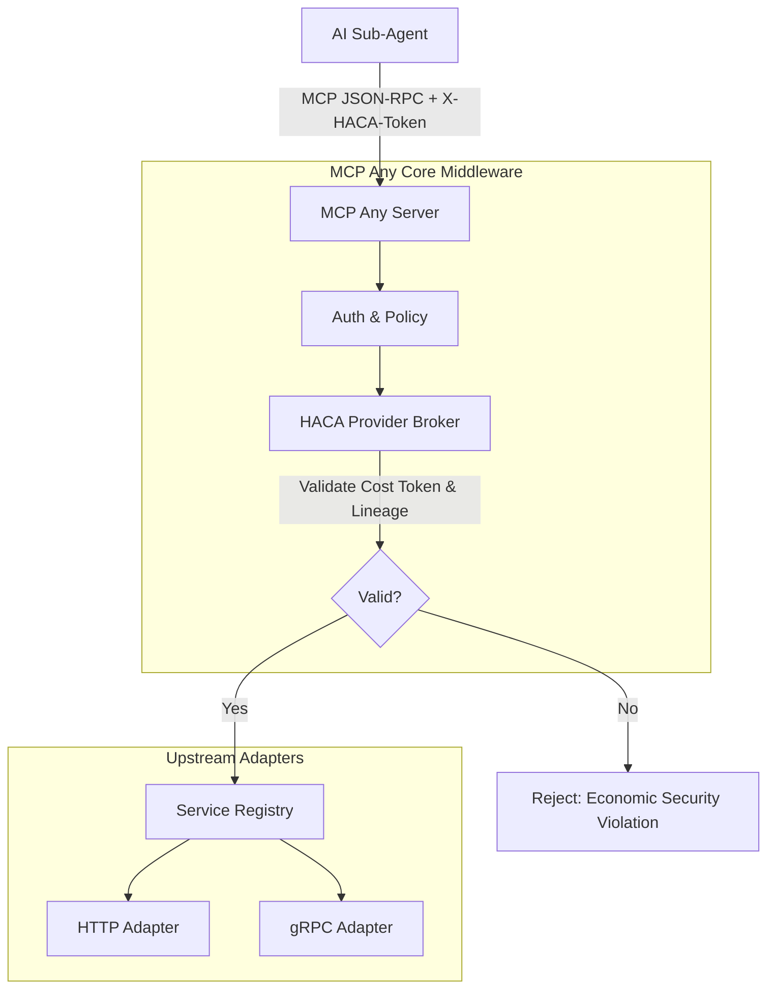

# Architectural Evolution: Hardware-Attested Cost Attribution (HACA) Provider
**Date:** 2026-07-12
**Author:** Principal Software Engineer & Core Systems Lead (L7)

## Problem Statement
As autonomous subagents operate within deep, heterogeneous swarms, tracking and attributing token usage and compute costs becomes increasingly difficult. Malicious or malfunctioning subagents can exhaust reasoning budgets ("Reasoning-Budget Hijacking") because costs are aggregated at the Gateway level rather than cryptographically bound to specific sub-process lineages.

## Proposed Solution: HACA Provider
MCP Any will evolve to act as the authoritative host for hardware-attested token attribution. We introduce the **Hardware-Attested Cost Attribution (HACA) Provider** middleware. This component mandates that every tool execution request includes a cryptographic token (`_x_haca_token`) that attributes the cost of the operation to a specific mission-root lineage.

### Core Logic
The HACA Provider acts as a middleware interceptor for MCP tool calls.

1. **Extraction**: It extracts the `_x_haca_token` and `_x_lineage_id` from the request arguments.
2. **Validation**:
   - If the token or lineage ID is missing for a required tool, the request is rejected with an `Economic Security Violation` error.
   - It validates the cryptographic signature of the token (simulated via prefix `haca-attested-` for this phase).
   - If the token is invalid, the connection is rejected to prevent budget exhaustion.
3. **Execution**: If valid, the HACA tokens are stripped from the arguments, and the request proceeds to the target Upstream Adapter.

### Architecture Mapping

## Impact
- **Security**: Mitigates "Reasoning-Budget Hijacking" by enforcing cryptographically bound cost attribution.
- **Economic Visibility**: Allows operators to trace exact compute/token costs down to the sub-process lineage level.
- **Standardization**: Enforces Google-standard economic security for autonomous AI swarms.
