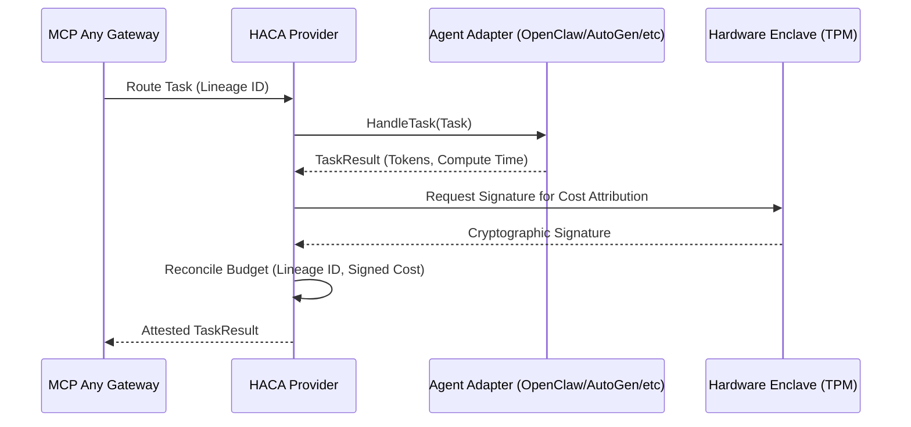

# Research: Hardware-Attested Cost Attribution (HACA) Provider
**Date:** 2026-07-12

## Context
The emergence of "Shadow-Attestation" vulnerabilities and the move toward "Hardware-Attested Cost Attribution" (HACA) confirm that **Mesh Stability** must be fail-operational and **Economic Transparency** must be hardware-locked. As swarms become high-density, infrastructure must move beyond static safety gates to active **Dynamic Mesh Resilience** and **Recursive Resource Reclamation**.

To neutralize "Economic Squatting," we are upgrading the Reasoning-Budget Firewall to support HACA. This layer will cryptographically attribute every token and compute millisecond to its specific sub-process lineage, ensuring absolute economic accountability across the mesh.

## Core Logic

The HACA Provider integrates directly into the universal `AgentFramework` interface via an interceptor pattern or as a standalone module that adapters can query or update. Every task handled by an agent must now report its hardware-attested cost attribution.

The provider performs the following logic:
1. **Lineage Tracing**: Extracts the cryptographic sub-process lineage from the incoming task.
2. **Cost Attribution**: Records the compute time, token count, and framework identifier associated with the task execution.
3. **Hardware Signature**: Signs the attribution record utilizing a simulated hardware enclave (TPM/SEP) bound identity.
4. **Budget Reconciliation**: Synchronizes the accumulated cost back to the parent mission-root budget.

## Mermaid Diagram

## Implementation Strategy
1. Introduce a `HACAProvider` struct in `src/interop/`.
2. Add a wrapping `HandleTaskWithAttribution` or a method to intercept standard adapter calls.
3. Define standard telemetry fields in `TaskResult` to hold the attested token usage and signature.
