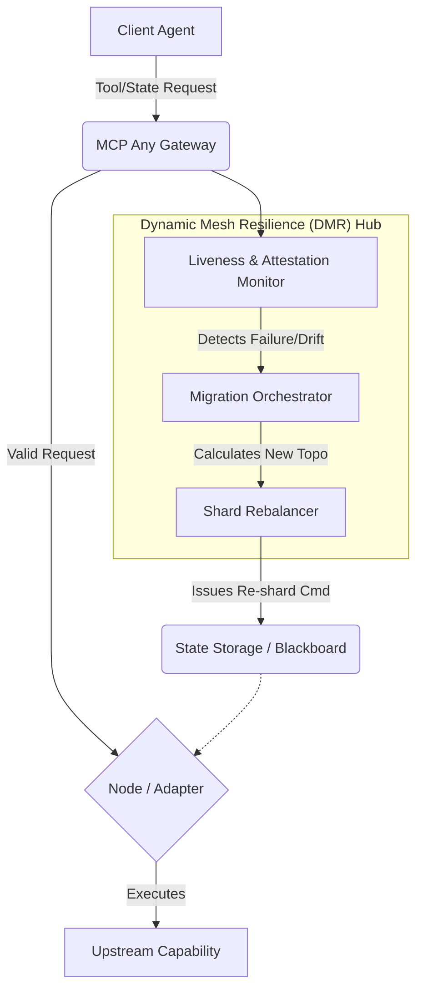

# Strategic Evolution: Dynamic Mesh Resilience (DMR)

**Date:** 2026-07-12
**Author:** Principal Software Engineer & Core Systems Lead (L7)
**Status:** Draft / Research

## 1. Executive Summary

The transition to horizontal, high-density AI agent swarms has exposed a critical fragility in point-in-time and static infrastructure orchestration. As agent ecosystems adopt frameworks like OpenClaw v3.6-beta with "Dynamic Mesh Resilience" and Gemini CLI's "Hardware-Attested Cost Attribution", the Universal Agent Bus (MCP Any) must pivot from a "Fail-Stop" architecture to a **"Fail-Operational"** model.

This document outlines the architectural evolution required to implement the **Dynamic Mesh Resilience (DMR) Hub**, enabling autonomous state migration and re-sharding across physical nodes in response to subagent failure or hardware attestation breaches, ensuring uninterrupted mission-root sovereignty.

## 2. Market Context & Urgency

Recent market signals indicate a fundamental shift in swarm operation requirements:
*   **OpenClaw v3.6-beta (Dynamic Mesh Resilience):** Swarms now expect the infrastructure to automatically re-shard and migrate "Entangled State" when nodes fail, rather than aborting the mission.
*   **Gemini CLI v0.51 (HACA):** Hardware-Attested Cost Attribution (ARE v1.9) demands that token and compute spend be cryptographically linked to sub-process lineages.
*   **"Shadow-Attestation" Timing Exploits:** Nanosecond drift between TPMs and system clocks is being weaponized to inject "Ghost Fragments" into reasoning traces.

MCP Any must evolve its coordination and state management layers to support dynamic, hardware-anchored resilience.

## 3. Core Logic: Dynamic Mesh Resilience (DMR) Hub

The DMR Hub acts as the central nervous system for swarm stability, sitting above the existing coordination and transport layers.

### 3.1. Primary Responsibilities

1.  **Heartbeat Monitoring:** Continuously monitor the liveness and attestation status of all participating physical nodes and subagent processes within a verified mission scope.
2.  **State Migration Orchestration:** Upon detecting a node failure or attestation breach (e.g., TPM timing drift anomaly), immediately trigger an atomic state migration protocol.
3.  **Re-sharding Strategy:** Dynamically re-calculate the optimal distribution of "Entangled State" shards across the remaining healthy nodes to balance cognitive load and preserve isolation boundaries.
4.  **HACA Compliance:** Ensure that all migration and re-sharding activities maintain the continuous cryptographic linkage required for Hardware-Attested Cost Attribution.

### 3.2. Architectural Flow

## 4. Implementation Strategy (Phased)

### Phase 1: DMR Core Interfaces and Telemetry
*   Define the core Go interfaces for `MeshNode`, `Shard`, and `DMRHub`.
*   Implement the `LivenessMonitor` to track node health and attestation validity.

### Phase 2: Migration Orchestrator
*   Develop the atomic state transfer mechanism between nodes.
*   Integrate with the `Entangled State Broker (ESB)` to ensure migrated state remains cryptographically bound.

### Phase 3: HACA and Clock-Drift Compensation
*   Implement monotonic clock-drift compensation to neutralize "Shadow-Attestation" exploits during migrations.
*   Ensure all state migrations preserve the ARE v1.9 lineage for cost attribution.
