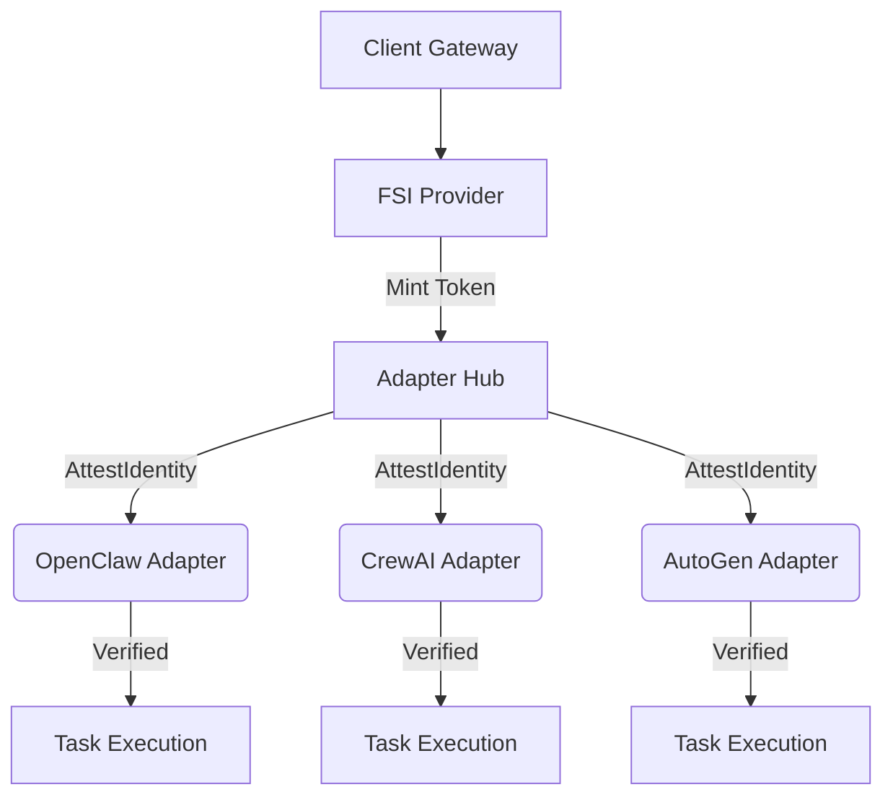

# Design Document: Federated Swarm Identity (FSI) Provider

## Strategic Evolution: [2026-07-12]
### Focus: Federated Swarm Identity & Mission-Root Sovereignty

**Context**: As agents increasingly form horizontal swarms, basic transport-layer security and binary handoffs are no longer sufficient. Identity Spoofing in heterogeneous meshes has demonstrated the need to cryptographically bind agent operations to a unified, mission-specific lineage.

**Strategic Pivot**:
- **Federated Swarm Identity (FSI) Provider**: MCP Any will act as the authoritative Identity Mint for connected agents, issuing hardware-attested, cross-framework identity tokens.

## Core Logic & Architecture
The FSI Provider serves as the zero-trust identity hub. Agent frameworks must request and successfully attest an identity token before performing core coordination tasks.

### Architecture Flow

## Implementation Details
1. **Core Interface Update**: Update `AgentFramework` in `bridge.go` to include `AttestIdentity(ctx context.Context, token string) error`.
2. **Provider Logic**: Create `fsi.go` with the `FederatedIdentityHub` containing methods `MintToken()` and `VerifyToken()`.
3. **Adapter Support**: Implement `AttestIdentity` across all current framework adapters to validate the hardware-bound token lineage.
