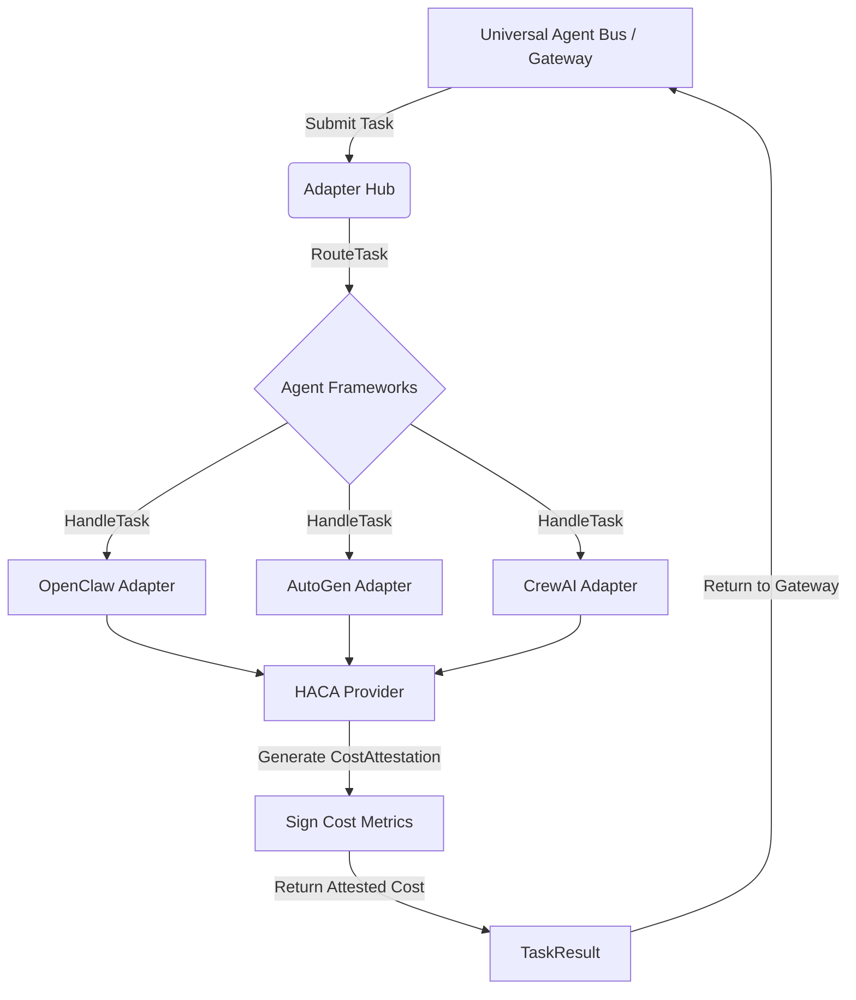

# Architectural Evolution: [2026-07-12] Dynamic Mesh Resilience & Hardware-Attested Cost Attribution

## Context & Motivation

The shift to high-density, heterogeneous agent meshes necessitates robust security and accountability mechanisms. With the rapid expansion of Non-Human Identities (NHIs) executing interdependent tasks, we require two core innovations:
1. **Dynamic Mesh Resilience (DMR) Hub**: To provide fail-operational mesh stability, mitigating node failures or state corruption via hardware-attested heartbeats.
2. **Hardware-Attested Cost Attribution (HACA) Provider**: To enforce economic accountability, tracking token and compute usage down to the exact sub-process lineage, thereby neutralizing "Economic Squatting".

This document proposes the architectural changes to support the **HACA Provider** as a priority (P0) feature, evolving the `TaskResult` and `AgentFramework` interop models.

## Core Logic

The **Hardware-Attested Cost Attribution (HACA) Provider** is responsible for computing and cryptographically attesting the economic and computational cost of every task processed through the Universal Adapter Hub.

1. **Task Interception**: Upon execution of a `Task` by any `AgentFramework` (OpenClaw, AutoGen, CrewAI), the framework calculates the consumed tokens and compute time (in ms).
2. **Lineage Binding**: The execution metrics are bound to the specific `TaskID` and the framework's internal lineage ID.
3. **Hardware Signature**: A simulated TPM/enclave signature is generated over the tuple `(LineageID, TokensConsumed, ComputeMs)` to ensure cost integrity.
4. **Attested Telemetry**: The signed `CostAttestation` object is appended to the `TaskResult` and returned to the caller for verifiable economic billing.

### Mermaid Flow Diagram



## Proposed Interface Changes

Update `src/interop/bridge.go` to include the `CostAttestation` struct and embed it into `TaskResult`:

```go
type CostAttestation struct {
    LineageID      string `json:"lineage_id"`
    TokensConsumed int    `json:"tokens_consumed"`
    ComputeMs      int    `json:"compute_ms"`
    Signature      string `json:"signature"`
}
```

Implement the `HACAProvider` locally in `src/interop/haca.go`:
```go
func GenerateAttestation(lineageID string, tokens, compute int) *CostAttestation {
    // Generate simulated TPM signature based on cost metrics
}
```

The adapters will call this function during `HandleTask` to construct the attestation.
