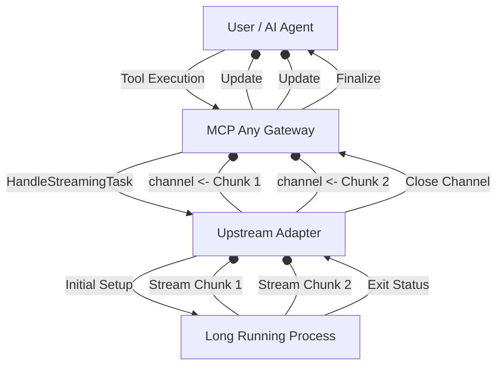

# Strategic Evolution: 2026-07-12

### Focus: Real-Time Telemetry and Streaming Execution Results (Implementation)
**Context**: As autonomous swarms perform deeper and more long-running tasks, waiting for an entire tool execution to complete before receiving output causes "Cognitive Stall" for the user and parent agents. The necessity to stream results incrementally was highlighted in previous architecture discussions (2026-06-18). We are now formalizing the implementation of `HandleStreamingTask` across all core `AgentFramework` adapters to ensure universal streaming support.
**Strategic Pivot**:
- **Streaming Tool Execution**: MCP Any formally introduces `HandleStreamingTask(ctx context.Context, task *Task, stream chan<- string) error` on the `AgentFramework` interface.
- **Incremental Context Updates**: By streaming tool execution, parent agents can dynamically adjust or abort long-running tasks if early streaming results deviate from the mission root.

## Core Logic

The core logic extends the `AgentFramework` to accept a streaming channel where chunks of output, intermediate reasoning steps, or progress updates can be emitted.

This structural evolution ensures that MCP Any remains the fastest, most responsive Universal Adapter for AI infrastructure.
