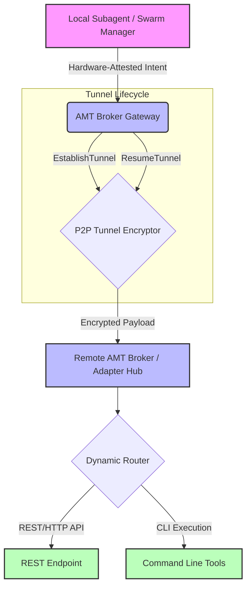

# Strategic Evolution: Attested Mesh Tunneling (AMT) Broker

**Date:** 2026-07-24
**Status:** Approved

## 1. Context and Scope
As AI agents move from single-device environments to distributed multi-node meshes (e.g., OpenClaw's Sovereign Node Tunneling), the risk of "Mesh Shadowing" and unauthenticated inter-node execution has become critical. The Universal Agent Bus must evolve beyond simple routing to active, hardware-locked mesh governance.

The **Attested Mesh Tunneling (AMT) Broker** is designed to provide hardware-attested, agent-aware encrypted P2P tunnels that maintain origin-locked sovereignty across physical device boundaries.

## 2. Core Logic

1.  **Attestation Initialization**: Before establishing a tunnel, the Broker validates a hardware-attested (e.g., TPM-signed) `missionToken`. This ensures the remote caller operates within the boundaries of a verified mission root.
2.  **Tunnel Establishment**: Creates an encrypted, session-bound P2P tunnel strictly mapped to the authorized hardware identity and mission root.
3.  **Fast-Path Resumption**: Issues a session-bound `Mesh Ticket` (trust lease) to bypass repeated high-latency hardware attestation handshakes, allowing for sub-millisecond tunnel resumption during deep swarm tasks.
4.  **Remote Invocation Proxy**: All remote tool calls are securely proxied over the tunnel with continuous semantic validation.

## 3. High-Level Architecture (Gateway to Adapters)

## 4. Implementation Details
- **Language:** Go
- **Package:** `server/pkg/amt`
- **Interfaces:** `Broker` with `EstablishTunnel`, `InvokeRemote`, `ResumeTunnel`
