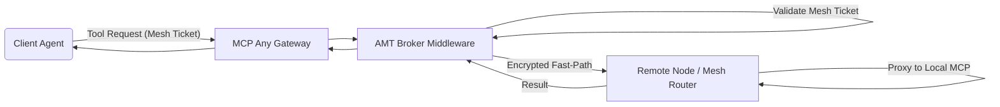

# Evolution: Fast-Path Mesh Resumption and Attested Mesh Tunneling (AMT) Broker

**Date:** 2026-07-24
**Status:** Draft

## 1. Executive Summary
As autonomous systems evolve into distributed meshes, agents operating across multiple devices require secure, cross-node communication without incurring significant latency overhead. The traditional requirement of performing a full hardware attestation for every inter-node operation leads to "Tunneling Overhead" and sub-millisecond execution degradation. This document outlines the implementation of the "Attested Mesh Tunneling (AMT) Broker," which addresses this by establishing secure, hardware-attested, encrypted P2P tunnels for multi-node agent mesh support, while optimizing with "Fast-Path Mesh Resumption" via session-bound "Mesh Tickets".

## 2. Core Logic
The Attested Mesh Tunneling (AMT) Broker acts as a middleware in the Universal Agent Bus.
1. **Full Attestation (Slow Path):** When initiating cross-node execution for a mission, the AMT Broker requires a full hardware (e.g., TPM) handshake to establish identity sovereignty and a persistent tunnel.
2. **Mesh Ticket (Fast Path):** Once a tunnel is established, a session-bound "Mesh Ticket" is generated and associated with the mission-root execution context. Subsequent requests leverage this Ticket for rapid resumption, allowing sub-millisecond task execution across nodes without compromising origin-locked integrity.

## 3. Impact
This ensures both high-security (hardware-backed origin validation) and high-performance (sub-millisecond latency for repeated operations inside a verified mission), solving the "Implicit Local Trust" problem while allowing agent teams (e.g. Claude Code, OpenClaw SNT) to operate efficiently in distributed settings.
