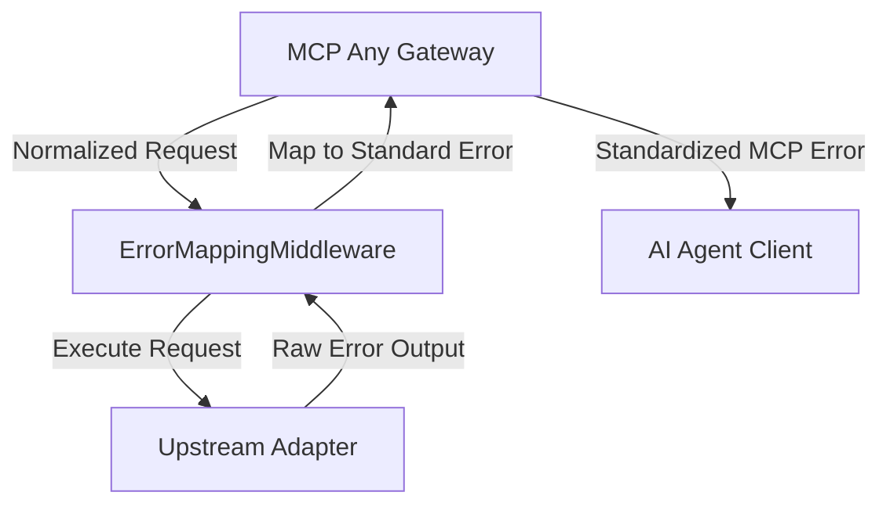

# Strategic Evolution: 2026-10-28

### Focus: Universal Error Mapping Middleware
**Context**: As the Universal Adapter scales to support more disparate backend APIs (REST, gRPC, CLI, GraphQL), handling errors robustly and consistently becomes a significant challenge. Various upstream services return distinct error codes and formats. When an AI agent encounters these diverse failures, its ability to auto-correct or meaningfully understand the error is degraded due to lack of standardization.

**Strategic Pivot**:
- **Universal Error Mapping**: MCP Any will introduce an `ErrorMappingMiddleware` that acts as a translation layer. It intercepts arbitrary errors from upstream Adapters (e.g., HTTP 500s, gRPC codes, CLI exit codes) and normalizes them into a standard `mcp.Error` payload. This guarantees that connected agents receive uniform, actionable error signals, drastically improving autonomous recovery rates and reducing prompt pollution caused by verbose or inconsistent error logs.

## Core Logic

The core logic introduces an `ErrorMappingMiddleware` situated between the core `mcpserver` handler and the upstream capabilities. It catches the generic error interface and normalizes the payload.

