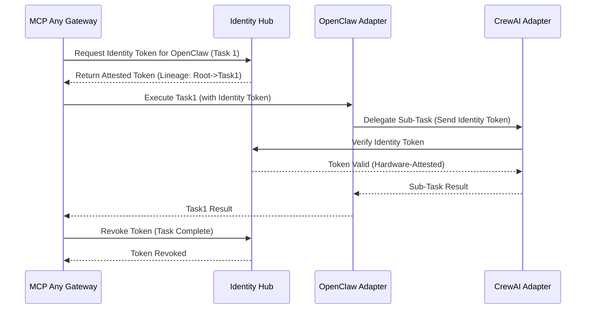

# Strategic Evolution: Zero-Trust Agent Identity Hub

**Date:** 2026-10-28
**Author:** Principal Software Engineer & Core Systems Lead (L7)

## Context
The rapid transition from simple LLM calls to fully autonomous, multi-agent service meshes confirms that **Identity** must now be mesh-resident and **Authentication** must be zero-trust. The proliferation of Non-Human Identities (NHI) and the complexity of horizontal teammate coordination demand that the "Universal Agent Bus" move beyond simple bridging to active **Identity Minting** and **Mesh-Bound Sovereignty**.

## Strategic Pivot: Zero-Trust Agent Identity Hub (ZTAIH)
MCP Any will evolve to act as the authoritative local identity service issuing hardware-attested, mesh-resident tokens for all connected agents. This ensures that every inter-agent interaction is authenticated and linked to a verified mission root.

## Core Logic
1. **Token Minting**: The hub mints session-bound, hardware-attested tokens tied to specific sub-processes or frameworks (e.g., OpenClaw, CrewAI).
2. **Lineage Tracking**: Every identity token contains a cryptographic lineage linking it to its parent task and mission root.
3. **Revocation**: The hub supports instantaneous revocation of capability tokens upon task completion or anomaly detection.
4. **Mesh-Resident Handshakes**: Handshakes between two frameworks mandate the presentation and validation of these hardware-attested identity tokens.

## Mermaid Diagram

