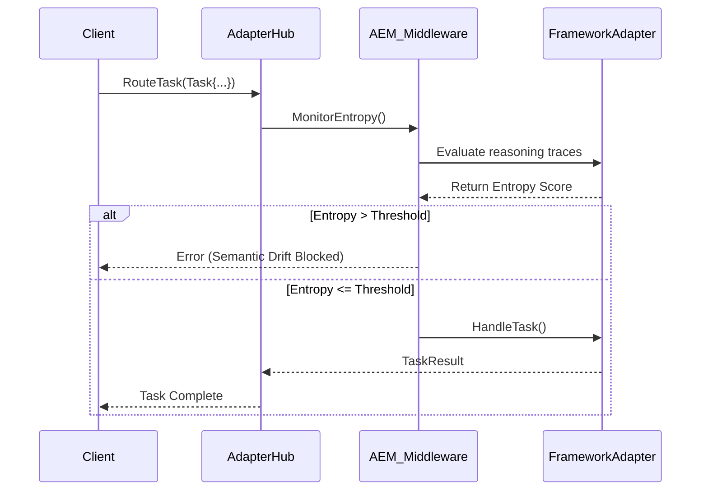

# Strategic Evolution: Agentic Entropy Monitor (AEM)

**Date:** 2026-11-02
**Status:** Draft

## 1. Executive Summary
This design doc introduces the Agentic Entropy Monitor (AEM) to the Universal Adapter. It acts as an authoritative coherence service performing real-time analysis of subagent reasoning entropy to block semantic drift.

## 2. Core Logic
The `AgentFramework` interface will be extended with the `MonitorEntropy` method. It intercepts tasks and evaluates their semantic variance or drift by calculating an entropy score before execution.

