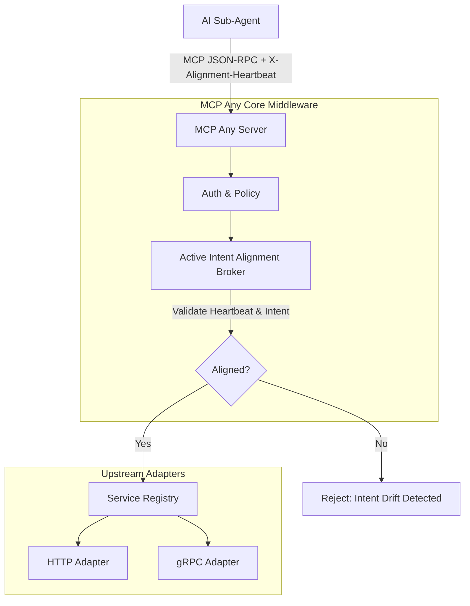

# Architectural Evolution: Active Intent Alignment (AIA) Broker
**Date:** 2026-06-17
**Author:** Principal Software Engineer & Core Systems Lead (L7)

## Problem Statement
The emergence of "Intent Drift" in cryptographically valid reasoning chains proves that static attestation and binary handoffs are no longer sufficient. As specialist agents operate in deep swarms, their cumulative reasoning paths can slowly deviate from the primary mission-root intent while maintaining valid cryptographic signatures.

## Proposed Solution: AIA Broker
MCP Any will evolve to act as the authoritative host for hardware-attested "Alignment Heartbeats." We introduce the **Active Intent Alignment (AIA) Broker** middleware. This component periodically verifies that specialist agent reasoning traces remain semantically aligned with the mission-root intent, neutralizing cumulative drift.

### Core Logic
The AIA Broker acts as a middleware interceptor for MCP tool calls.

1. **Extraction**: It extracts the `X-Mission-Root-Intent` and `X-Alignment-Heartbeat` from the request context or headers.
2. **Validation**:
   - If the intent or heartbeat is missing for a required trace, the request is rejected with an `Intent Drift Detected` error.
   - It validates the cryptographic signature of the heartbeat (simulated via basic string/hash validation for this phase).
   - It performs semantic validation (simulated via strict structural checks) to ensure the current action aligns with the root intent.
3. **Execution**: If aligned, the request proceeds to the target Upstream Adapter. If drifted, the connection is suspended or rejected to prevent further misalignment.

### Architecture Mapping

## Impact
- **Security**: Mitigates "Intent Drift" by enforcing continuous mission alignment.
- **Reliability**: Prevents deep swarms from getting stuck in "Cognitive Stall" due to unaligned speculative paths.
- **Standardization**: Enforces Google-standard rigor and expands our Universal Adapter vision.
