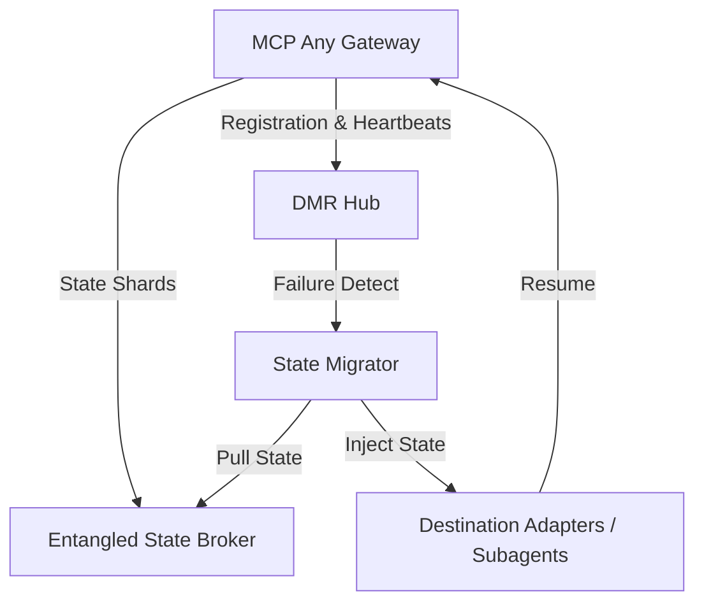

# Evolution: Dynamic Mesh Resilience (DMR) Hub
**Date:** 2026-07-11

## Core Logic

As swarms become high-density, infrastructure must move beyond static safety gates to active Dynamic Mesh Resilience. The Dynamic Mesh Resilience (DMR) Hub acts as the authoritative "Resilience Broker" for MCP Any. It utilizes hardware-attested heartbeats to monitor node health and automatically re-shard and migrate mission-critical "Entangled State" between physical nodes upon detection of subagent failure or attestation breach.

The DMR Hub provides a fail-operational architecture, ensuring that the mission survives the loss of individual subagents or infrastructure nodes without manual intervention, maintaining sub-100ms state migration.

## Architectural Flow

