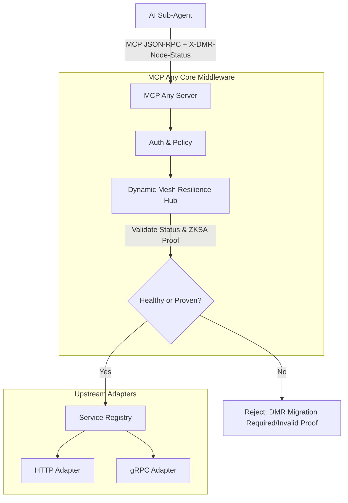

# Architectural Evolution: Dynamic Mesh Resilience (DMR) Hub
**Date:** 2026-07-12
**Author:** Principal Software Engineer & Core Systems Lead (L7)

## Problem Statement
The emergence of "Agent Teams" in horizontal swarms introduces a critical single-point-of-failure: Physical Node Residency. When a specialist subagent operating within a deep mesh experiences hardware failure or network partition, the shared context and assigned task locks are lost. The swarm experiences a "Cognitive Stall," requiring a full mission-root restart to recover the state.

## Proposed Solution: DMR Hub
MCP Any will evolve to act as the authoritative coordination service for "Zero-Knowledge State Attestation (ZKSA)" migrations. We introduce the **Dynamic Mesh Resilience (DMR) Hub** middleware. This component proactively monitors node health and orchestrates the cryptographic re-sharding and migration of state between physical nodes upon subagent failure, ensuring uninterrupted mission continuity.

### Core Logic
The DMR Hub acts as a critical reliability interceptor for MCP tool calls directed at stateful services.

1. **Extraction**: It extracts the `X-DMR-Node-Status` and `X-ZKSA-Migration-Proof` from the request context or arguments.
2. **Validation**:
   - If the target node is reported as `failed` and no migration proof is provided, the request is rejected with a `DMR: Migration Required` error to prevent data corruption.
   - If a migration proof is provided (simulated via strict structural validation of the attestation string), the DMR Hub verifies the proof against the new physical node's identity.
   - It performs semantic validation to ensure the migrated state aligns with the original mission-root constraints.
3. **Execution**: If the node is healthy or the migration is cryptographically proven, the request proceeds to the target Upstream Adapter. If the proof is invalid, the connection is suspended or rejected to prevent "Identity Spoofing" during the vulnerable migration phase.

### Architecture Mapping

## Impact
- **Reliability**: Eliminates "Cognitive Stalls" by enabling seamless state recovery across physical boundaries.
- **Security**: Mitigates "Identity Spoofing" during migration via mandatory Zero-Knowledge State Attestation (ZKSA).
- **Standardization**: Enforces Google-standard resilience and expands our Universal Adapter vision to distributed swarms.
