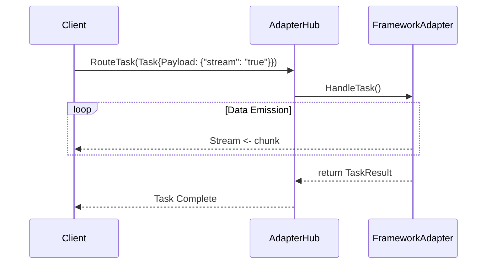

# Evolution: Streaming Support in Interop

**Date:** 2026-07-12
**Status:** Draft

## 1. Executive Summary
This design doc introduces native streaming support to the Universal Agent Bus (MCP Any) to handle progressive output from multi-agent swarms.

## 2. Core Logic
The `TaskResult` interface will be extended to include an optional `Stream` channel. When streaming is requested (e.g. `Stream: true` in the task payload), adapters will yield results incrementally over this channel.

