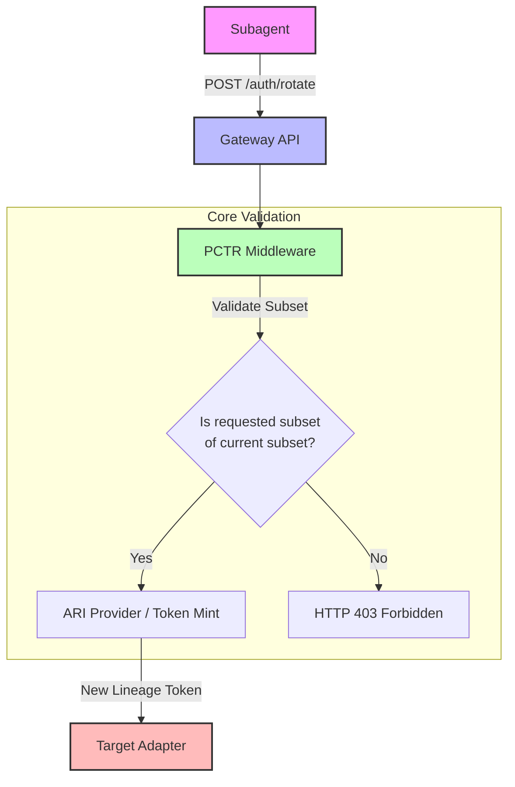

# Design Doc: Privilege-Constrained Token Rotation (PCTR)

**Status:** Draft
**Created:** 2026-07-25

## 1. Context and Scope
The disclosure of CVE-2026-32922 in OpenClaw revealed a critical failure in token rotation logic where newly minted tokens could inherit broader scopes than the original requestor (e.g., rotating from `pairing` to `admin`). As MCP Any evolves into a universal identity hub for AI agents, it must ensure that the token rotation process is strictly monotonic regarding authority.

PCTR provides the core infrastructure to validate that any rotation event results in a scope set that is a mathematical subset of the caller's active authority.

## 2. Goals & Non-Goals
* **Goals:**
    * Mathematically enforce scope subsetting during rotation.
    * Provide hardware-attested (TPM) audit trails for every rotation event.
    * Support "Least-Privilege Branching" where sub-tokens can be minted with further restricted scopes.
* **Non-Goals:**
    * Managing the underlying identity provider (IdP).
    * Providing persistent token storage (handled by SRM/Blackboard).

## 3. Critical User Journey (CUJ)
* **User Persona:** Autonomous Mesh Orchestrator
* **Primary Goal:** Safely rotate session tokens for 50+ specialized subagents without risking privilege escalation.
* **The Happy Path (Tasks):**
    1. Subagent requests a token rotation via the PCTR middleware.
    2. PCTR retrieves the caller's active scope set from the ARI Provider.
    3. PCTR validates that the requested scopes are a strict subset of the active set.
    4. Hardware enclave signs the new token with a lineage-bound signature.
    5. The new token is issued, and the old token is invalidated atomically.

## 4. Design & Architecture
* **System Flow:**
    `[Subagent] -> [PCTR Middleware] -> [ARI Provider (TPM)] -> [Scope Validator] -> [Signed Token]`
* **APIs / Interfaces:**
    * `POST /v1/auth/rotate`: Accepts old token and requested scope subset.
    * `X-PCTR-Lineage`: Header containing the cryptographic proof of authoritative parentage.
* **Data Storage/State:**
    * Utilizes the `ARI Provider` to maintain an atomic map of active session tokens and their lineage.

## 5. Alternatives Considered
* **Implicit Trust (Rejected):** Assuming the framework handles scopes correctly (Failed in CVE-2026-32922).
* **Static Token Lifetimes (Rejected):** Increases the window of exploit for stolen tokens.

## 6. Cross-Cutting Concerns
* **Security (Zero Trust):** Rotation never increases authority; every event is hardware-attested.
* **Observability:** Every rotation is logged with its parent lineage ID and scope diff.

## 8. Core Logic & Gateway-to-Adapter Flow

The core logic of PCTR enforces strict monotonic subsets of scopes. When a subagent requests a token rotation at the Gateway, PCTR intercepts the request.

PCTR prevents "ghost mirroring" and ensures that `new_scopes ⊆ current_scopes` cryptographically or logically before generating the rotated token.
