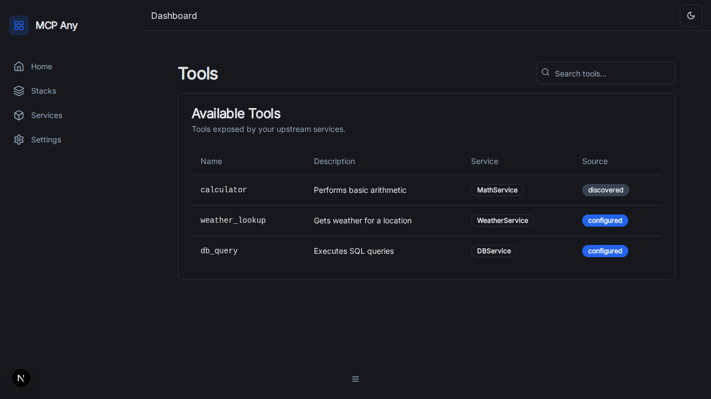
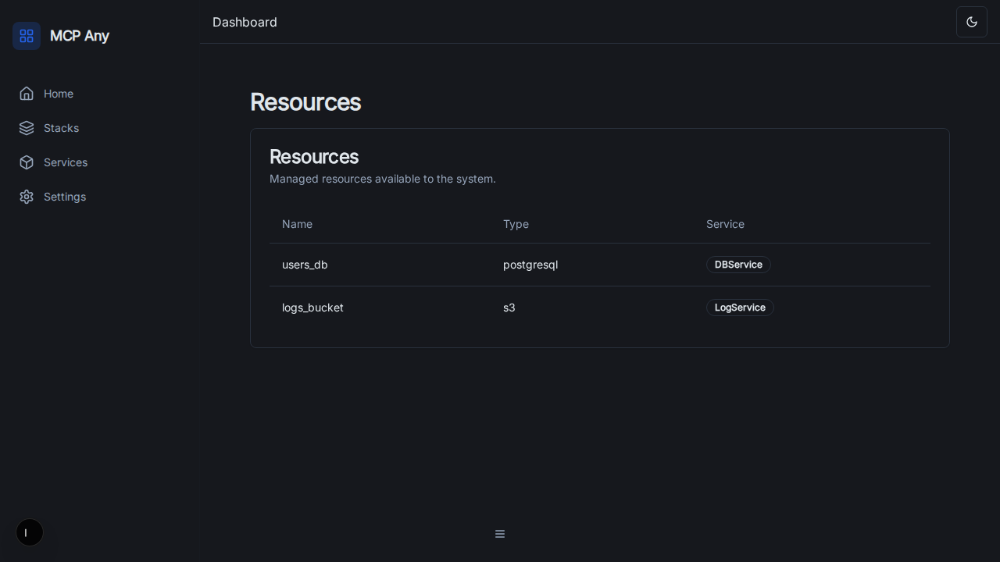
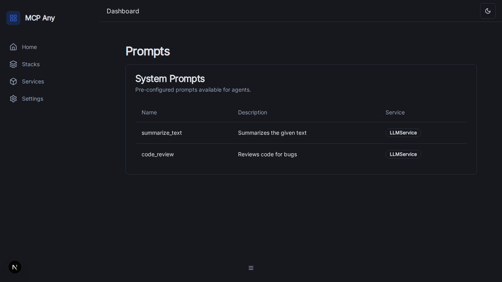
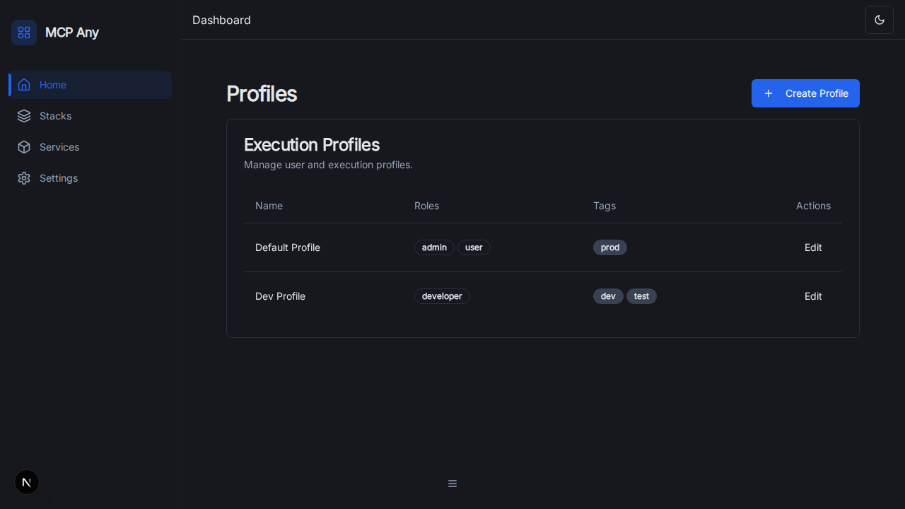
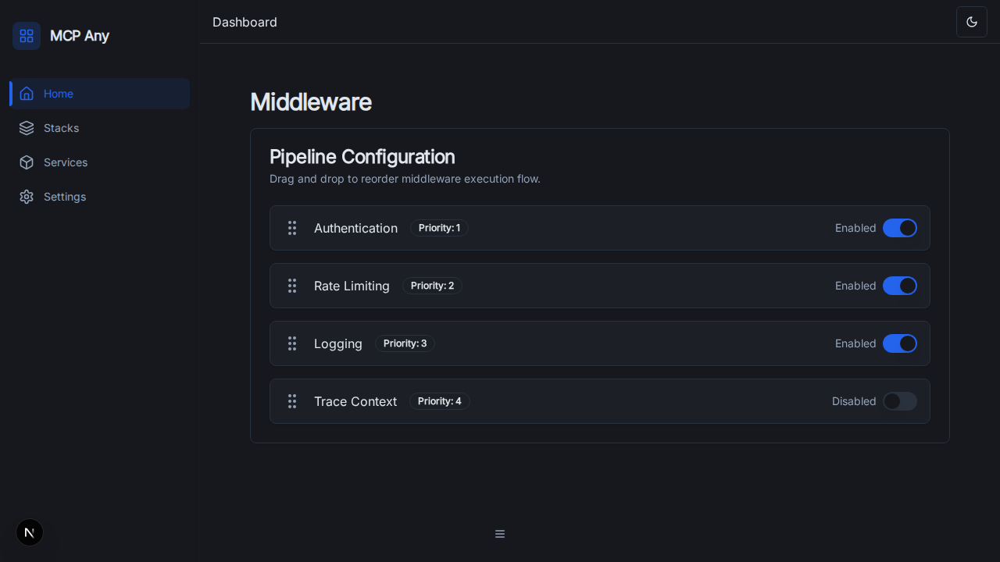

# MCP Any UI Features

This document describes the features of the MCP Any Management UI.

## Dashboard
The dashboard provides a real-time overview of the system status, including connected services, active tools, and request metrics.

## Core Management

### Services
Manage upstream services. You can view details, toggle status, and edit configurations.

### Tools
Explore discovered tools from connected services.

### Resources
View and manage available resources.

### Prompts
View system prompts available to agents.

### Profiles
Manage execution profiles for different environments (dev, prod, etc.).

## Advanced Features

### Middleware
Configure the request processing pipeline. Drag and drop middleware to reorder priority.

### Webhooks
Configure global webhook settings and test webhook events.

