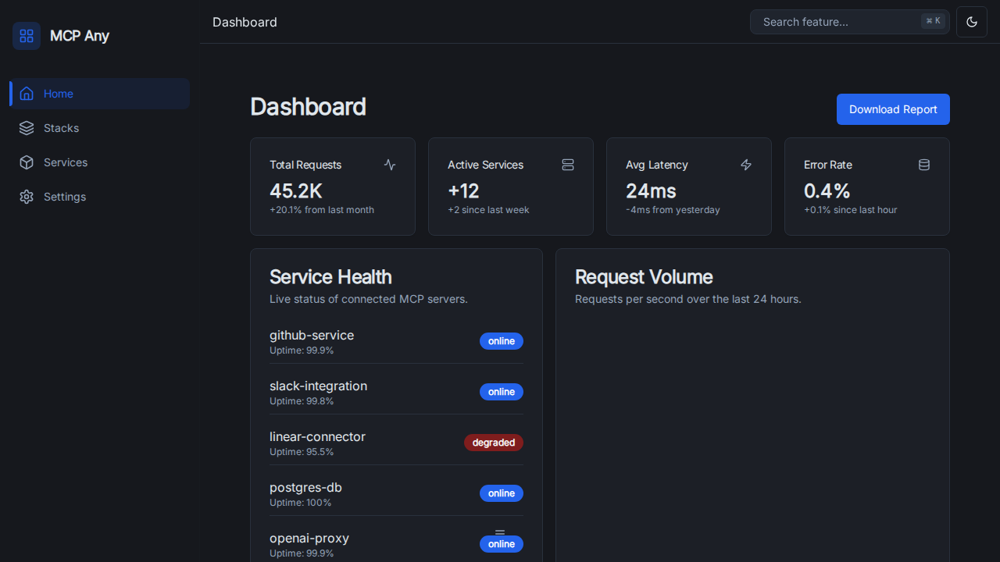
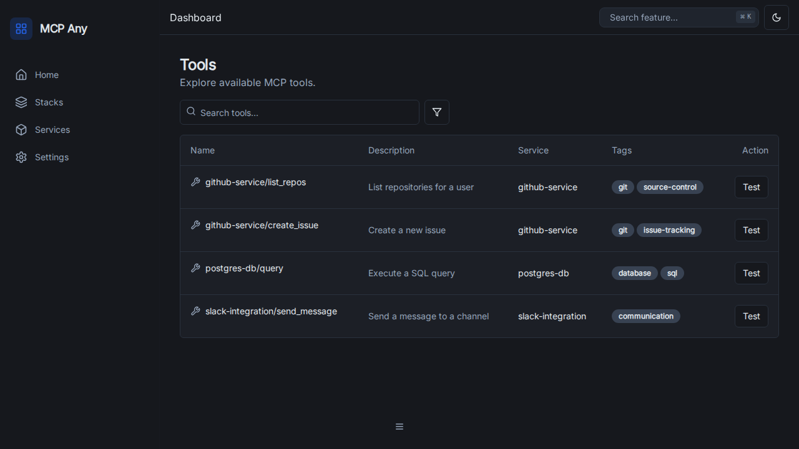
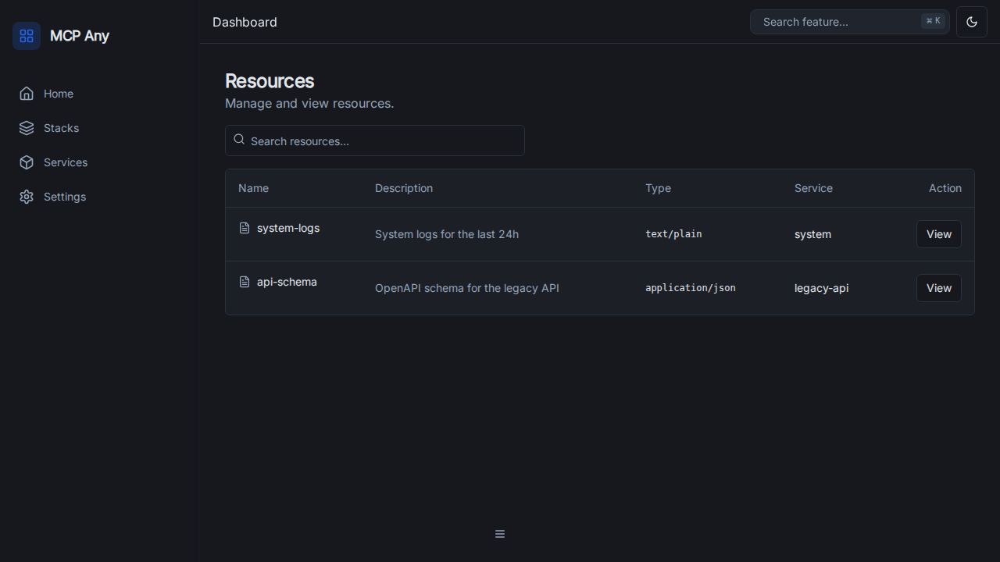
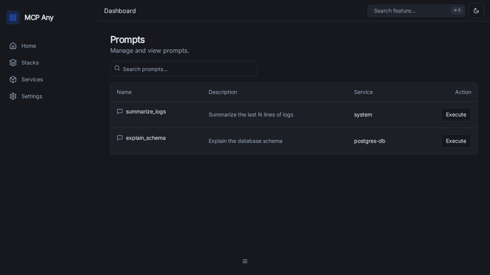
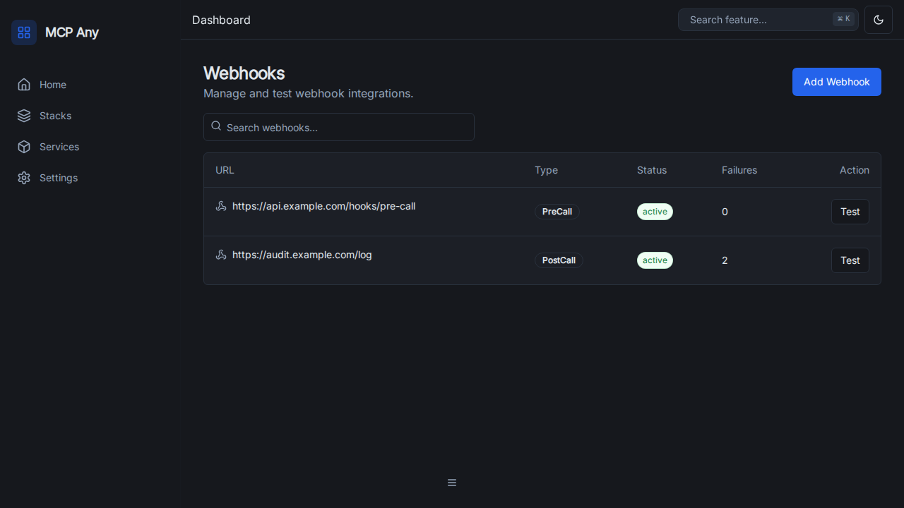

# MCP Any Manager UI Features

This document details the features implemented in the MCP Any Manager UI overhaul.

## Overview
The UI has been redesigned with a modern, enterprise-grade aesthetic inspired by Apple and Ubiquiti/Unifi. It features a responsive layout, clean typography, and a "glassmorphism" header.

## Features

### 1. Dashboard & Observability
The dashboard provides real-time visibility into the health and performance of the MCP ecosystem.
*   **Metrics Overview:** Cards displaying Total Requests, Active Services, Average Latency, and Error Rates.
*   **Service Health:** A scrollable widget showing the live status (Online/Offline) and uptime of connected services.
*   **Request Volume:** A chart visualizing request traffic over the last 24 hours.

### 2. Service Management
A central hub for managing upstream MCP services.
*   **List View:** View all registered services with their type, status, endpoint, and enabled state.
*   **Toggle:** Enable or disable services with a single click.
*   **Filtering:** Search services by name or type.
*   **Actions:** Context menu for viewing details, editing configuration, or deleting services.

### 3. Tool Explorer
Discover and manage tools exposed by connected services.
*   **Searchable List:** Quickly find tools by name or description.
*   **Metadata:** View tool descriptions, source service, and tags.
*   **Testing:** (Future) Interface to execute tools directly from the UI.

### 4. Resources
View and manage static or dynamic resources provided by services.
*   **List View:** Browse resources with type and description.
*   **Preview:** (Future) View resource content directly in the browser.

### 5. Prompts
Manage LLM prompts defined by services.
*   **List View:** Browse available prompts.
*   **Execution:** (Future) Run prompts with custom arguments.

### 6. Profiles
Manage execution profiles (e.g., Dev, Prod) to control access and configuration.
*   **List View:** View and edit profiles.

### 7. Middleware Pipeline
A visual editor for the request processing pipeline.
*   **Visual Graph:** Drag-and-drop interface (using `react-flow`) to configure middleware order and connections.
*   **Configuration:** (Future) Click nodes to configure specific middleware settings.

### 8. Webhooks
Manage and test webhook integrations.
*   **List View:** View configured webhooks, their type (PreCall/PostCall), and status.
*   **Testing:** (Future) Trigger test events to verify webhook delivery.

## Verification
All features are verified using:
1.  **Unit Tests:** Vitest tests for components.
2.  **Integration Tests:** Testing user flows.
3.  **E2E Tests:** Playwright tests simulating real user interaction.
4.  **Visual Audit:** Screenshots captured during E2E runs (embedded above).
