# MCP Any UI User Manual

Welcome to the MCP Any User Interface. This manual provides a comprehensive guide to navigating and using the UI features.

## Dashboard

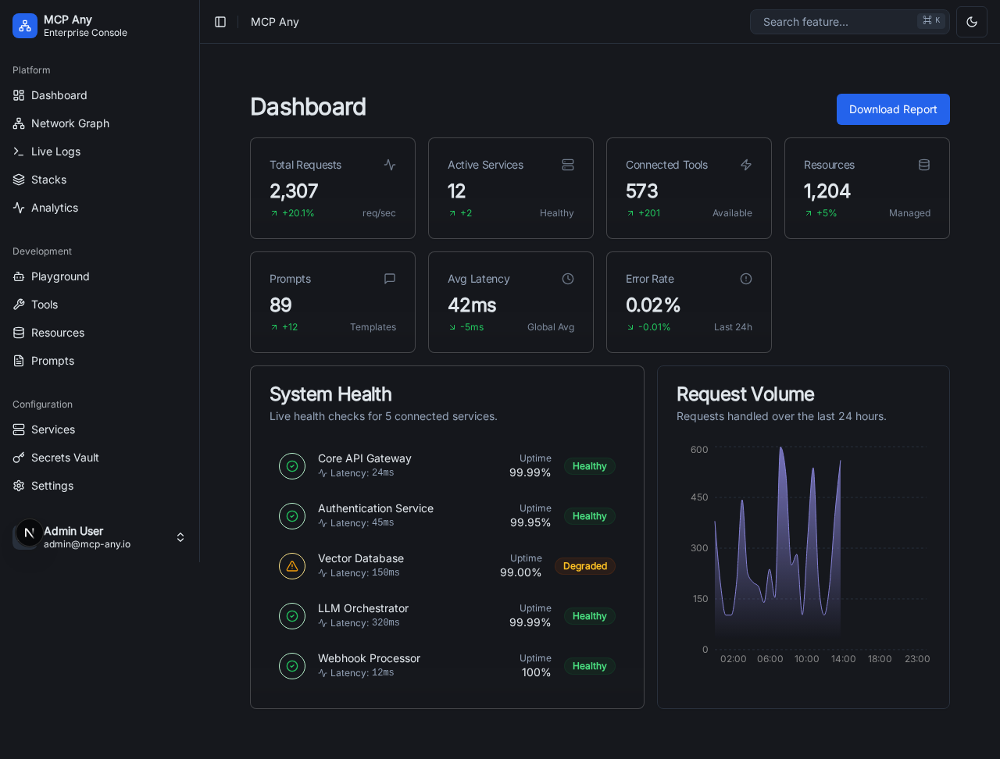
The Dashboard serves as the command center for your MCP system. It provides a high-level overview of the system's health, active services, and recent activity. You can quickly navigate to other sections from here.

## Network

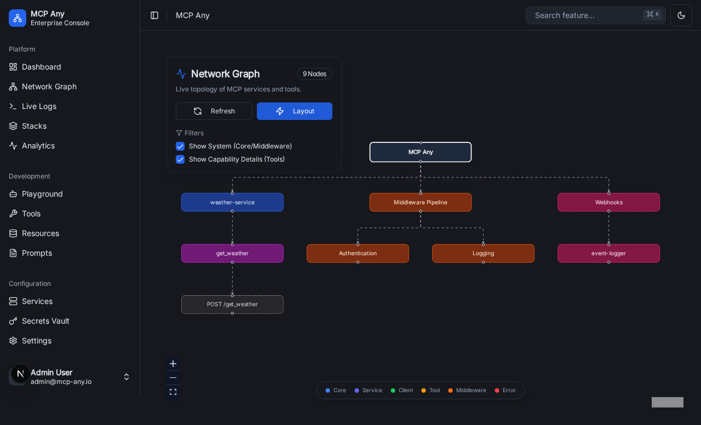
The Network view provides a topological visualization of your MCP components.

- **Topology**: Visual graph of services and connections.
- **Node Status**: Color-coded status indicators (e.g., green for online).
- **Inspection**: Click nodes for more details.

## Logs

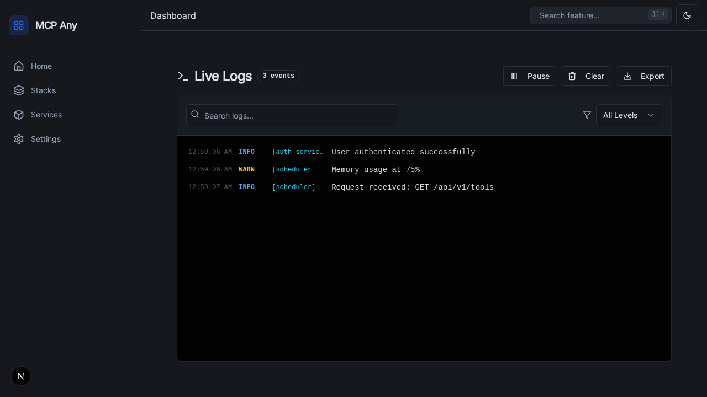
Centralized logging for all MCP activities.

- **Real-time Stream**: Watch logs as they happen.
- **Filtering**: Filter by service, severity, or keyword.

## Stacks

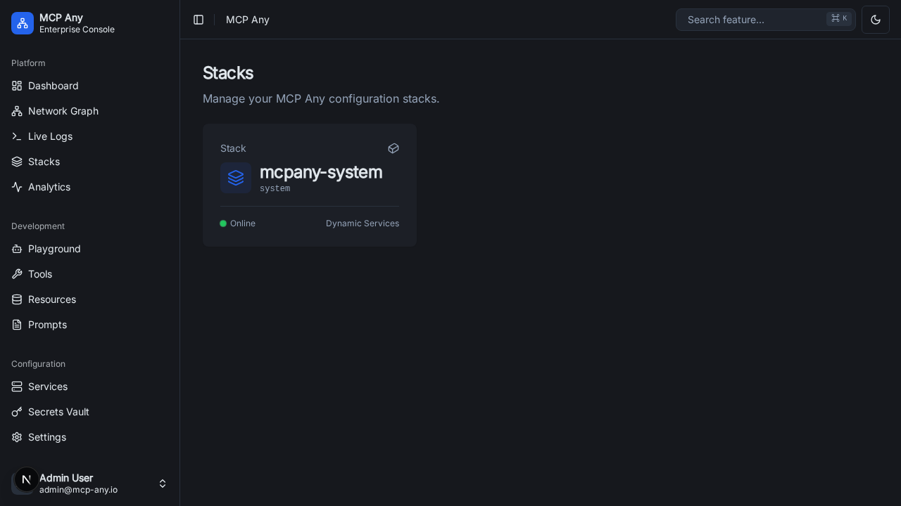
Manage stacks of MCP services and configurations.

- **Overview**: List of active stacks.
- **Management**: Deploy, update, or remove stacks.

## Services

The Services page lists all the upstream MCP servers connected to your system.

- **View Services**: See a list of all registered services.
- **Service Status**: Check if a service is online or offline.
- **Details**: Click on a service to view its details, including available tools and resources.

## Tools

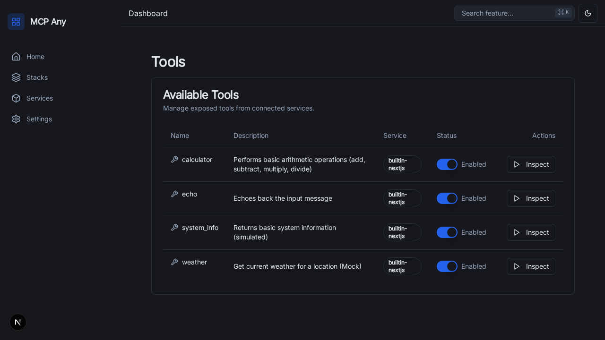
The Tools section aggregates all tools provided by your connected services.

- **Search**: Find specific tools by name or functionality.
- **Inspect**: View tool schemas and input parameters.
- **Execute**: Run tools directly from the UI (subject to permissions).

## Resources

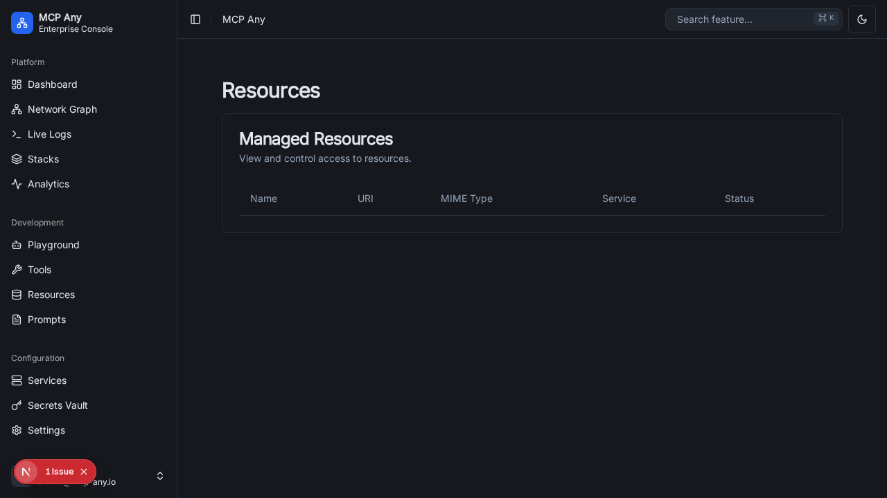
Resources represent data sources exposed by your MCP servers.

- **File Access**: Browse filesystem resources if available.
- **Data Inspection**: View the content of specific resources.

## Prompts

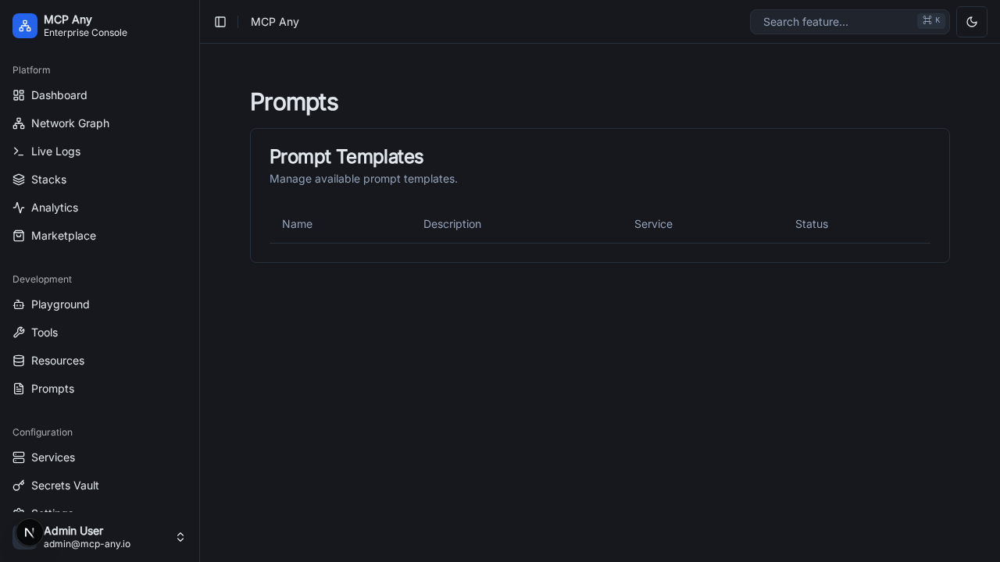
Prompts allow you to manage and use predefined prompt templates.

- **Library**: View available prompts from different services.
- **Usage**: Select a prompt to use in your interactions.

## Profiles

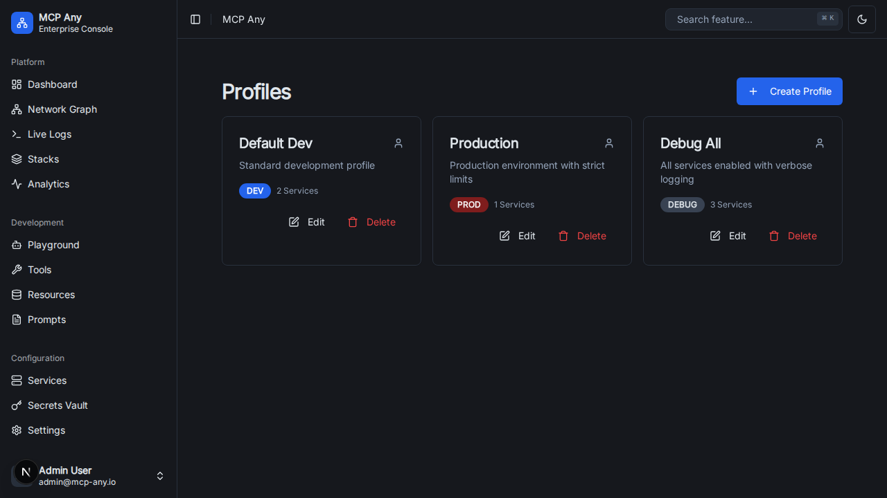
Profiles manage configuration sets, allowing you to switch between different environments or security contexts easily.

- **Create/Edit**: Define new profiles with specific settings.
- **Switch**: Activate a different profile to change system behavior.

## Middleware

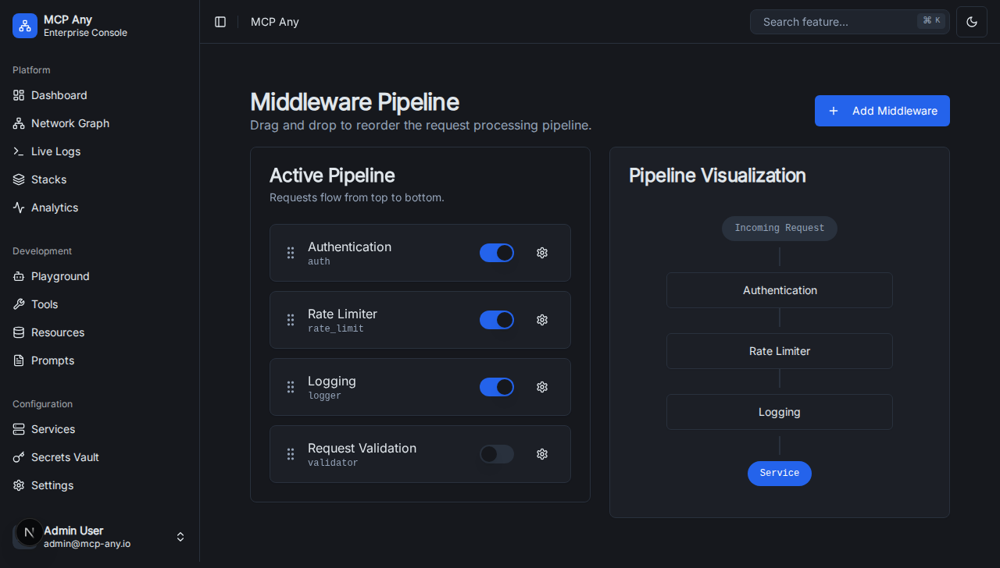
The Middleware section allows you to configure the processing pipeline for MCP messages.

- **Chain Configuration**: Define the order of middleware components.
- **inspect**: View details of enabled middleware.

## Webhooks

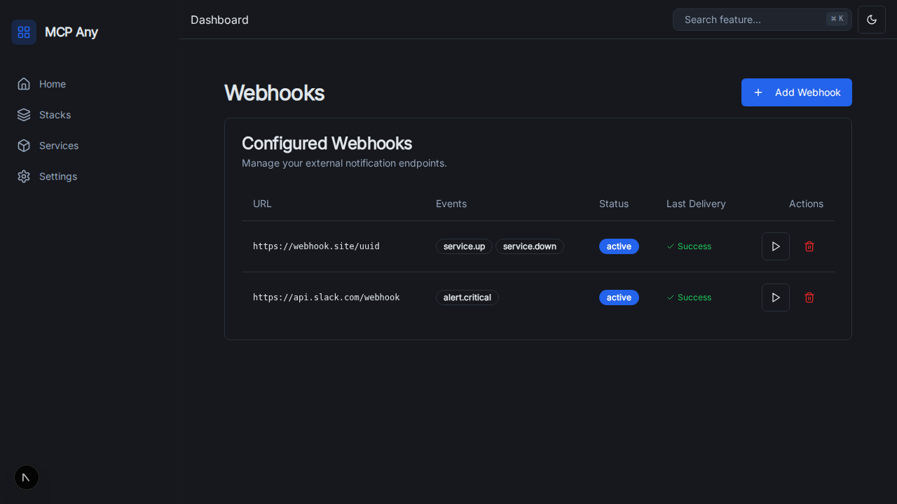
Manage webhooks to integrate MCP Any with external systems.

- **Register**: Add new webhook endpoints.
- **Monitor**: Check the status and history of webhook deliveries.

## Stats & Analytics

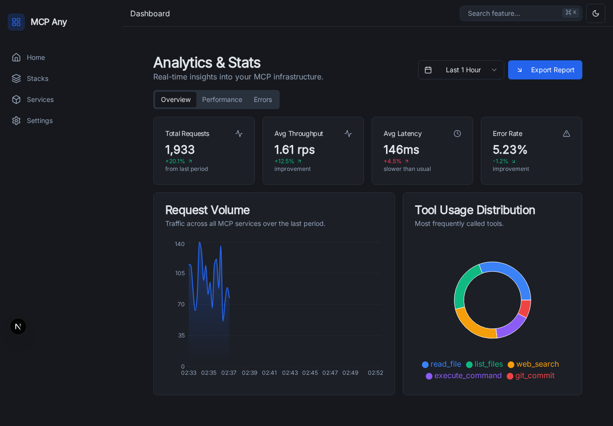
Performance metrics and usage statistics.

- **Throughput**: Request rates and latency.
- **Errors**: Error rates and distributions.

## Playground

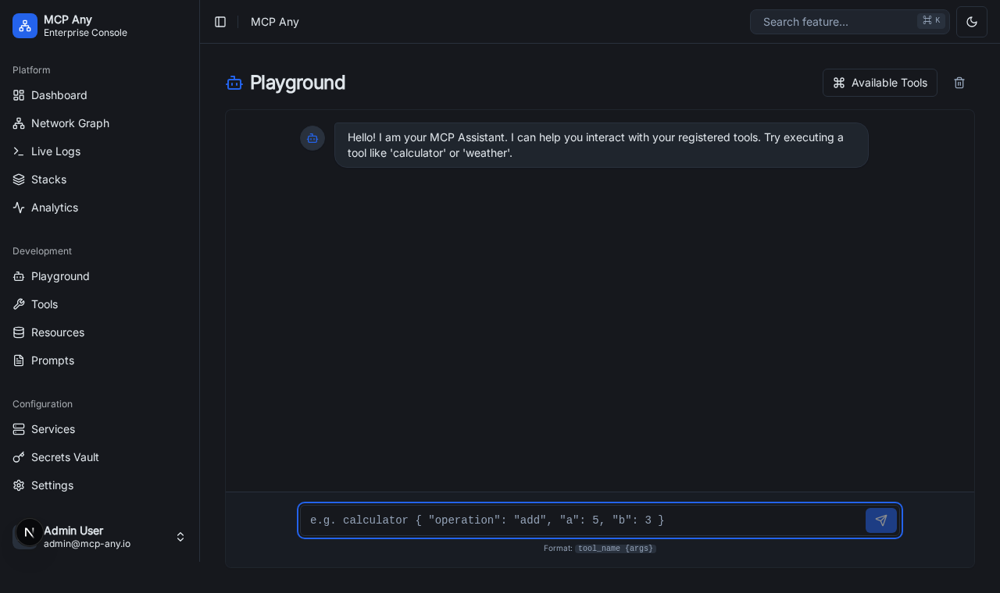
Interactive playground for testing MCP features.

- **Experiment**: Test tools and prompts in a safe environment.
- **Debug**: Analyze response structures and behavior.

## Settings

The Settings page allows you to configure global preferences and system-wide options.

### General

- **General**: basic configuration like theme and language.

### Profiles Configuration

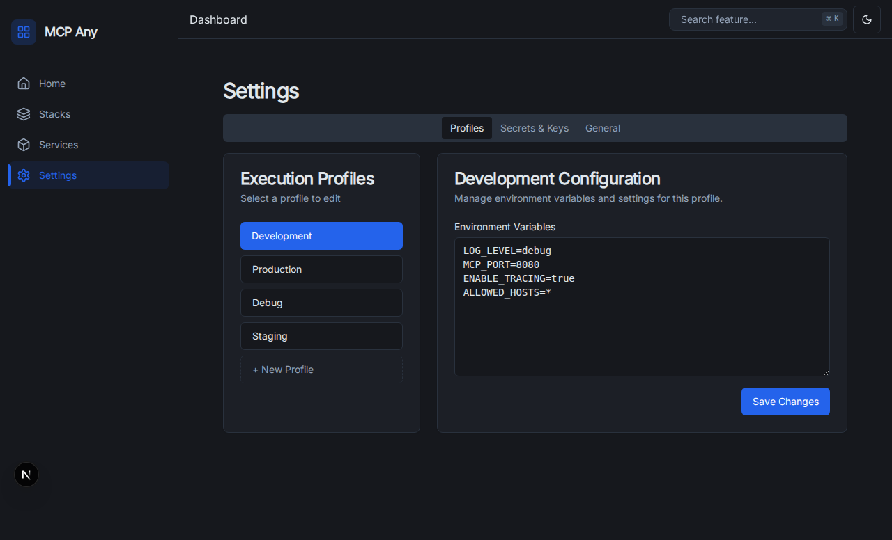

- **Profile Details**: Advanced configuration for specific profiles.

---

_This manual is auto-generated and updated with the latest UI screenshots._
