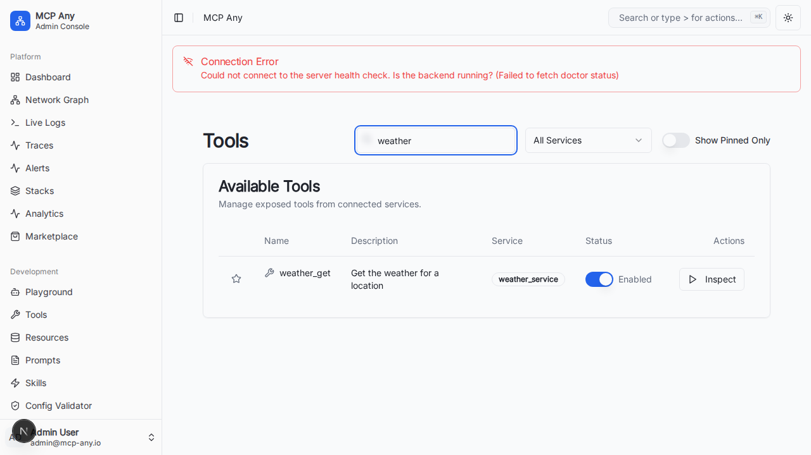

# Tool Search Bar

The **Tool Search Bar** provides a quick and efficient way to find specific tools within the MCP Any management dashboard.

## Overview

As the number of connected services and tools grows, finding a specific tool can become difficult. The Tool Search Bar allows users to filter the list of available tools by name or description instantly.

## Usage

1.  Navigate to the **Tools** page in the dashboard.
2.  Locate the search input field in the toolbar (next to the "Filter by Service" dropdown).
3.  Type a keyword (e.g., "weather", "calculator").
4.  The list of tools will update in real-time to show only those matching your query.

## Visuals

## Technical Details

-   **Filtering Logic**: The search is performed client-side on the currently loaded list of tools.
-   **Fields Searched**: Matches against `name`, `description`, and `serviceId` (case-insensitive).
-   **Combination**: Works in conjunction with the "Filter by Service" and "Show Pinned Only" filters.
