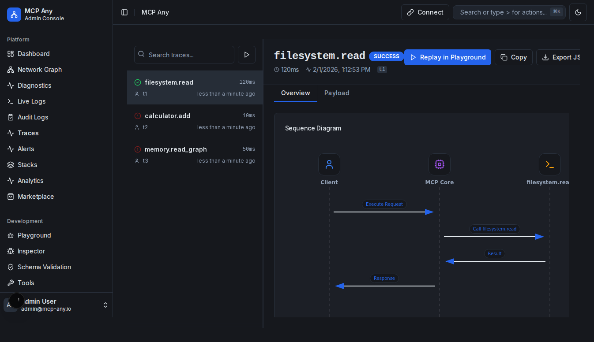

# Live Trace Inspector

**Status:** Implemented

## Goal

Debug complex interactions by inspecting the full lifecycle of MCP requests. The Trace Inspector allows you to examine payloads, timing, and errors for every tool call and API request.

## Usage Guide

### 1. Trace List

Navigate to `/traces`. This view shows a chronological log of all system activity.

- **Status Icons**: Green check for success, Red X for failure.
- **Duration**: Time taken for the request to complete.

### 2. Inspect Detail

Click on any row in the trace list to open the **Detail View**.
this view is split into tabs:

- **Request**: The JSON arguments sent to the tool.
- **Response**: The JSON output returned.
- **Timeline**: A waterfall view of the operation lifecycle (Request -> Call -> Result -> Response).

### 3. Replay Trace

To quickly reproduce a bug or test a tool:

1. Open a trace detail.
2. Click the **"Replay in Playground"** button.
3. You will be redirected to the Playground with the tool and arguments pre-filled.

### 4. Export & Share

To share a trace with your team or attach it to a bug report:

- **Copy**: Click the **Copy** button to copy the full trace JSON to your clipboard.
- **Export JSON**: Click **Export JSON** to download the trace as a `.json` file.
### 5. Smart Diagnostics

When a trace contains an error (e.g., Schema Validation Error, Connection Refused), the inspector automatically analyzes the failure and provides a **Diagnostics & Suggestions** card.

This feature detects common issues like:

- **Schema Validation Errors**: Input arguments mismatching the tool definition.
- **Permission Errors**: File system access denied.
- **JSON Errors**: Invalid JSON payloads.
- **Timeouts**: Operations taking too long.
- **Connection Failures**: Upstream services being unreachable.
