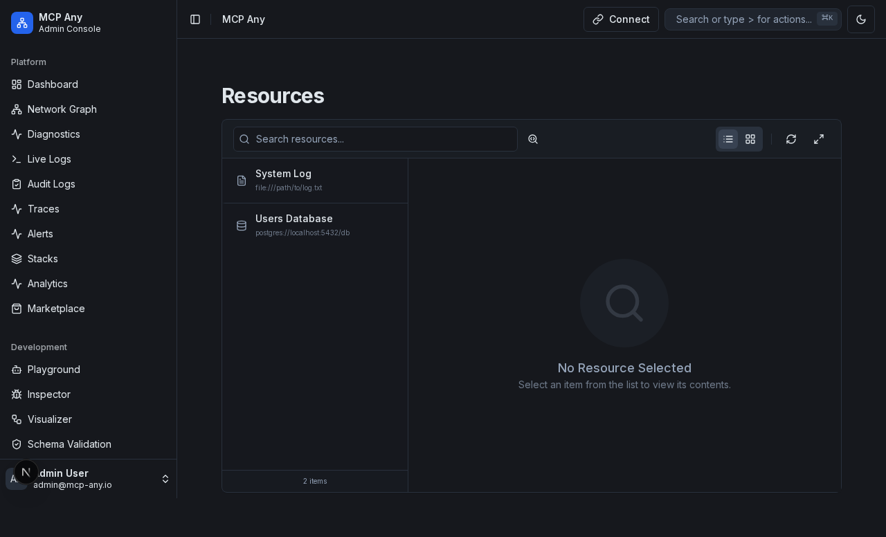
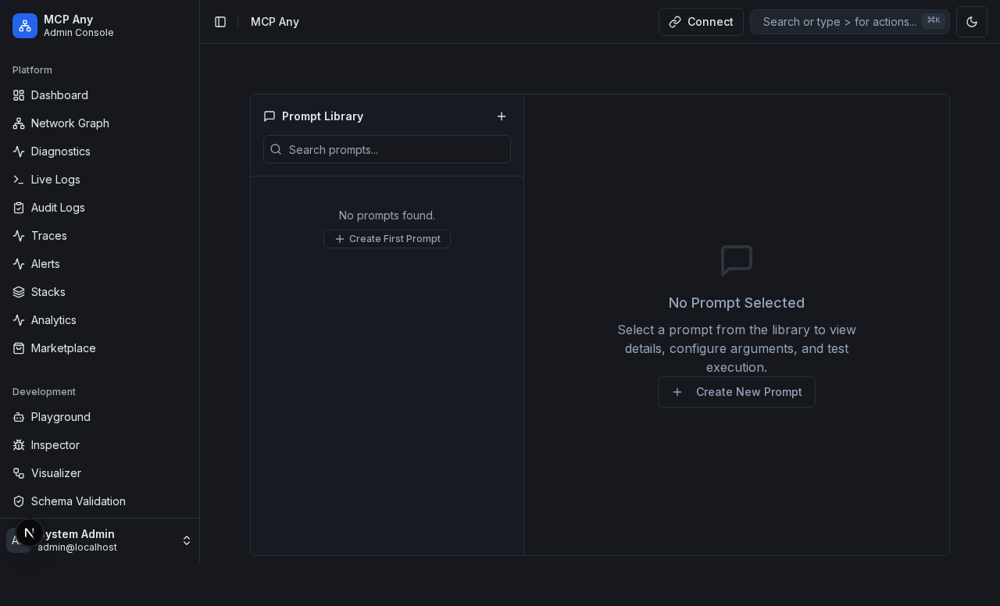
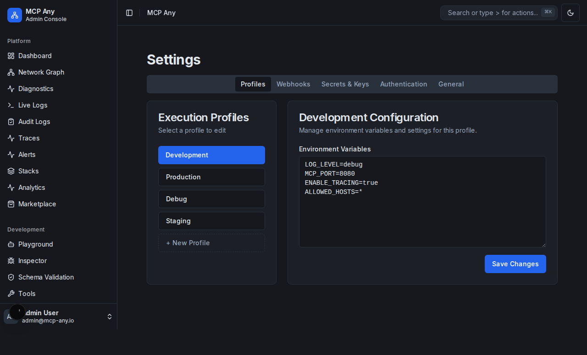
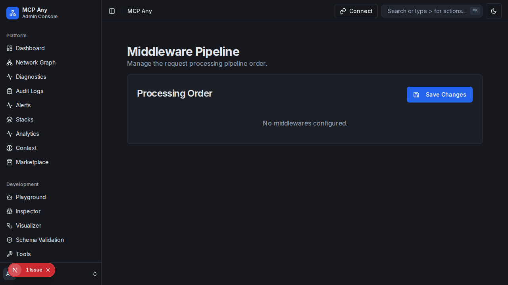
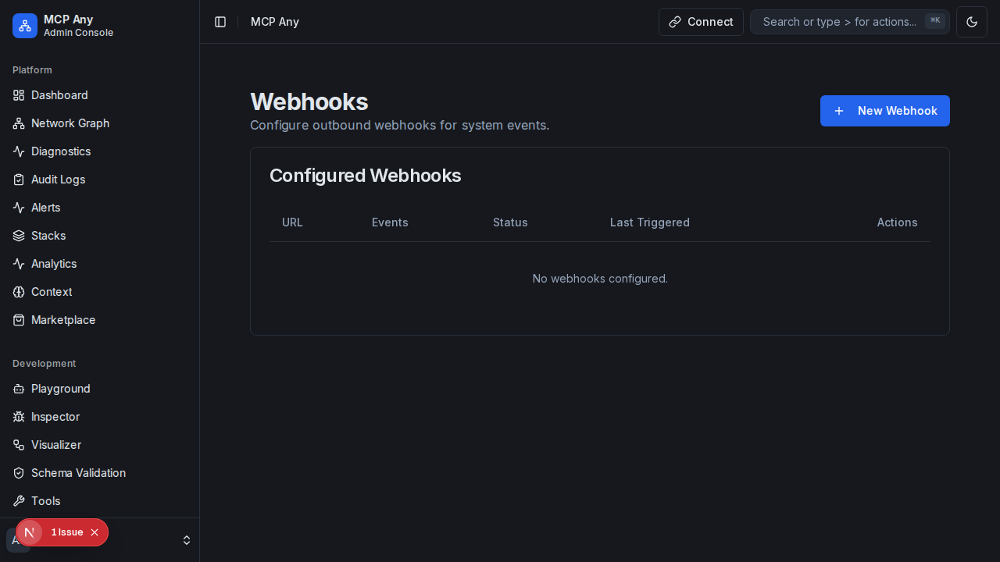
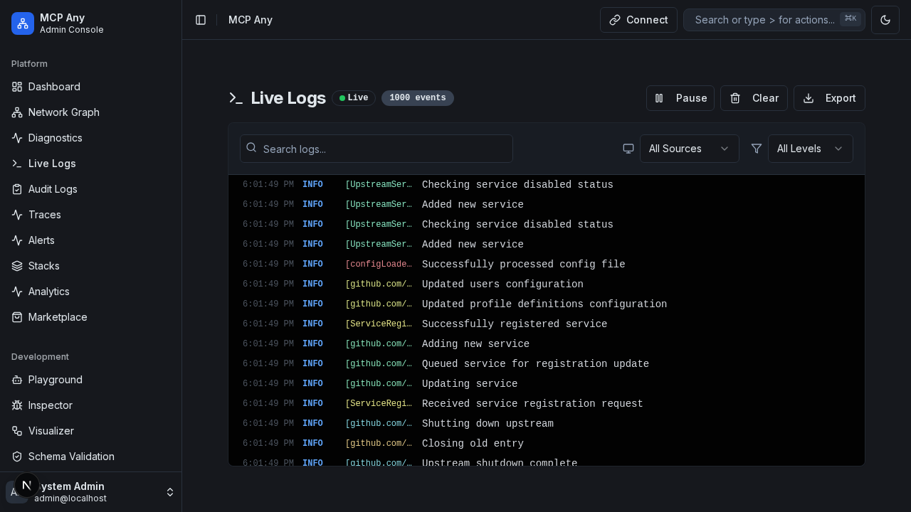
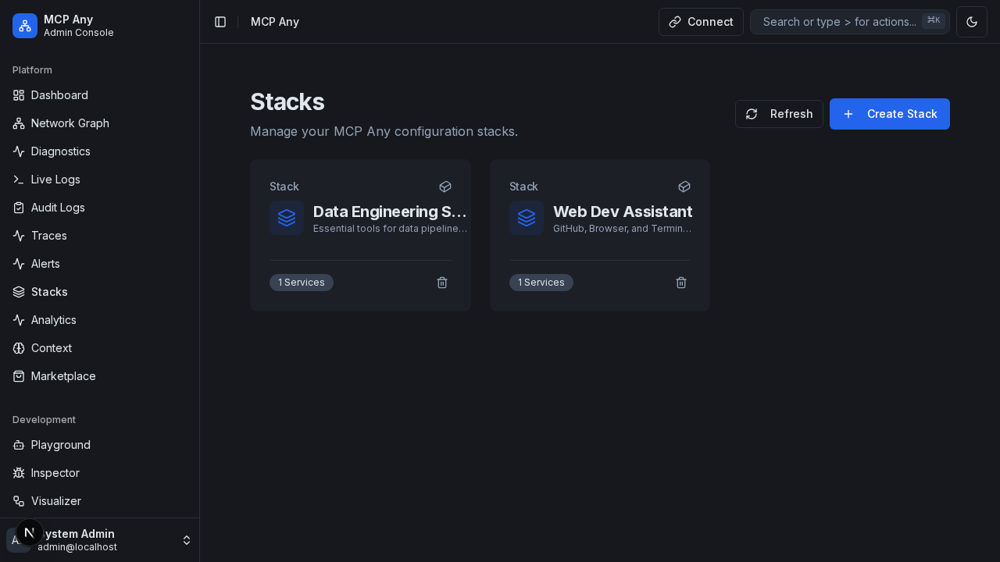
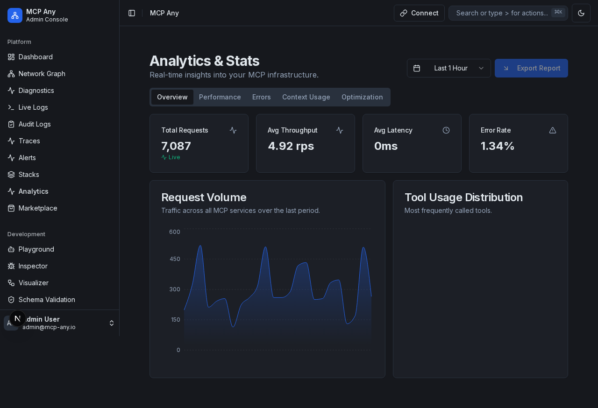

# MCP Any UI Overhaul - Feature Documentation

## Overview

This document outlines the new "Apple/Ubiquiti" inspired UI for the MCP Any management console. It covers the dashboard, core management features, and advanced configurations.

## 1. Dashboard & Observability

The dashboard provides a high-level overview of the system's health and performance.

*   **Real-time Metrics:** Displays Request/Sec, Active Services, Connected Tools, and Latency.
*   **Visual Aesthetics:** Uses glassmorphism (backdrop blur), clean typography, and subtle shadows.

## 2. Core Management

### Services
Manage upstream services (HTTP, gRPC, MCP, CMD).
*   **List View:** See all registered services with their status and version.
*   **Toggle:** One-click enable/disable.
*   **Edit:** Configure service details via a side sheet.

### Tools
View and manage tools exposed by upstream services.
*   **List View:** Filterable list of tools.
*   **Status:** Enable/Disable individual tools.

### Resources
Manage static and dynamic resources.
*   **Control:** Toggle access to specific resources.

### Prompts
Manage prompt templates.
*   **Templates:** View available prompts and their arguments.

## 3. Profiles
Manage execution profiles for different environments (Dev, Prod, Debug).
*   **Card Layout:** Quick overview of profile settings.
*   **Management:** Create, Edit, Delete profiles.

## 4. Advanced Features

### Middleware
Visual pipeline editor for request processing.
*   **Drag & Drop:** Reorder middleware easily.
*   **Visualization:** See the flow of a request from ingress to service.

### Webhooks
Configure outbound webhooks for system events.
*   **Management:** Add new webhooks, test delivery, and view status.

### Logs
System logs and events.

### Playground
Interactive playground for testing tools and prompts.

### Settings
System-wide settings.

### Stacks
Manage deployment stacks.

### Stats
System statistics and analytics.

## 5. User Preferences Persistence

All UI settings and customizations must be persisted in the backend database (SQLite). This ensures that user configurations are preserved across sessions (login/logout) and cognition modes.

### Persisted Settings Include:
- **Dashboard Layout:** Widget positions and visibility.
- **Theme Preferences:** Dark/Light mode, high contrast.
- **Chart Settings:** Timeframes (e.g., 24h vs 7d), metrics selection.
- **Table Preferences:** Column visibility, sorting, filtering.
- **Profile Selection:** Last active profile.
