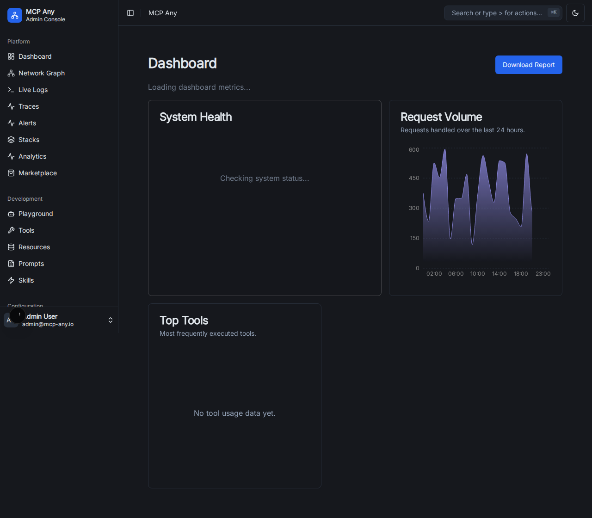
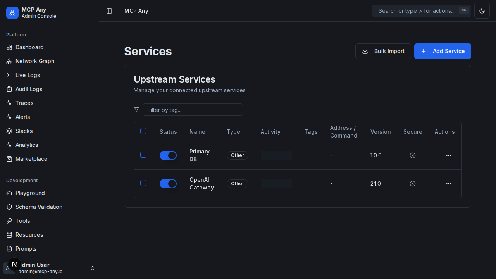
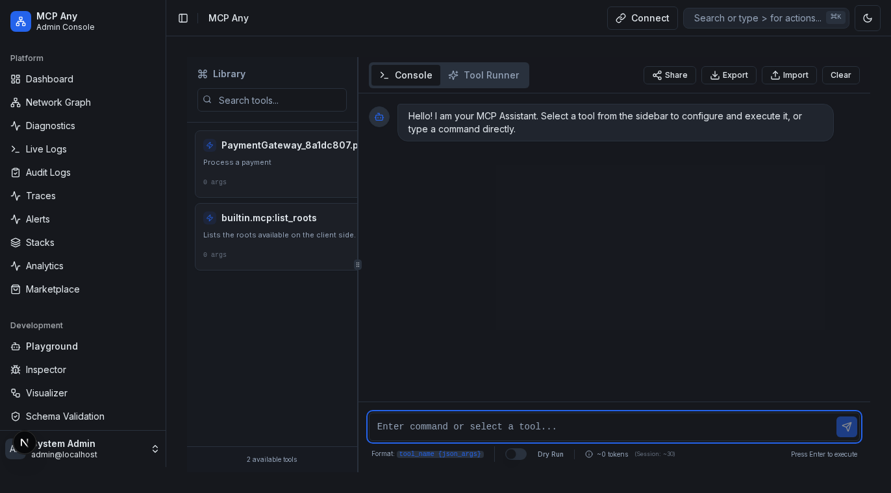

# MCP Any UI Features

This document outlines the features implemented in the MCP Any UI Overhaul.

## 1. Dashboard
**Path:** `/`

The dashboard provides a high-level overview of the system's health and performance.

*   **Real-time Metrics:** Displays Total Requests, Active Services, Average Latency, and Active Users.
*   **Service Health:** Lists connected upstream services with their status (Healthy, Degraded, Unhealthy), uptime, and version.

## 2. Services Management
**Path:** `/services`

Manage upstream services connected to MCP Any.

*   **List View:** detailed table of services including Type, Version, Status, and Priority.
*   **Toggle:** Enable/Disable services directly from the list.
*   **Actions:** Configure or Delete services via the dropdown menu.

## 3. Tools, Resources, & Prompts
**Paths:** `/tools`, `/resources`, `/prompts`

Explore the capabilities exposed by the connected MCP servers.

*   **Tools:** List of available tools (functions) with descriptions and types.
*   **Resources:** List of static resources (files, blobs) available for access.
*   **Prompts:** Pre-defined prompts and their arguments.

## 4. Settings & Advanced Configuration
**Path:** `/settings`

Configure system-wide behaviors.

*   **Profiles:** Manage execution environments (Development, Production).
*   **Webhooks:** Configure event notifications.
*   **Middleware:** Visualize the request processing pipeline.

## Testing Strategy
All features are verified using Playwright E2E tests.
Run tests with: `cd ui && npx playwright test`
