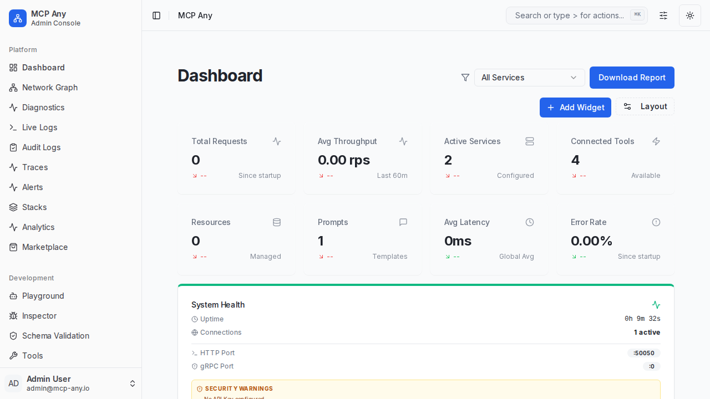

# Compact Density Mode

The **Compact Density Mode** allows users to optimize the display of information within the MCP Any Management Dashboard. By reducing padding, font sizes, and spacing, users can view more data on the screen at once, providing a dense, information-rich experience suitable for power users and large deployments.

## Features

- **Global Toggle**: Switch between "Comfortable" (default) and "Compact" modes from the global header.
- **Persistent Preference**: Your choice is saved to your browser's local storage and remembered across sessions.
- **Affected Areas**:
    - **Resource Explorer**: Reduced list item padding and font size; smaller grid cards.
    - **Dashboard**: Reduced gap between widgets.
    - **Service List**: Reduced row height and font size for denser tables.

## Usage

1.  Click the **View Options** button (slider icon) in the top-right header.
2.  Select **Compact** to enable high-density mode.
3.  Select **Comfortable** to return to the standard layout.

## Screenshots

