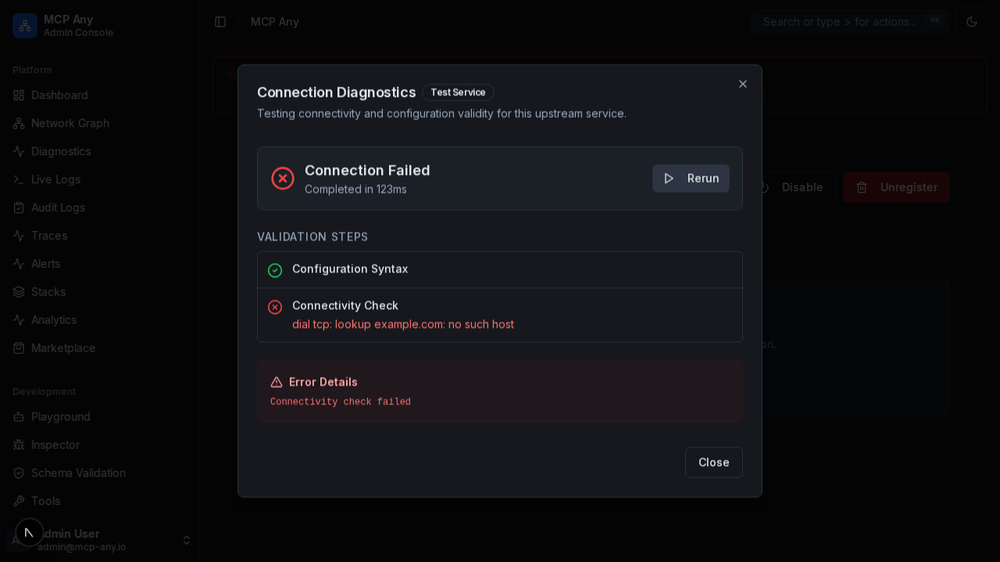

# Connection Diagnostics

The **Connection Diagnostic Tool** helps users troubleshoot connectivity issues between MCP Any and upstream services. It provides a guided, step-by-step analysis of the connection path, from client-side checks to backend health verification.

## Key Features

-   **Multi-Stage Analysis**:
    1.  **Configuration Check**: Validates the service configuration (URL format, required fields).
    2.  **Browser Connectivity**: Checks if the service is reachable from the user's browser (useful for identifying local network issues).
    3.  **Backend Health**: Queries the MCP Any backend to see if it can reach the upstream service.
    4.  **Operational Verification**: Attempts to list tools and resources to ensure full functionality.

-   **Smart Heuristics**:
    -   **Localhost/Docker Detection**: Automatically detects if a user is trying to connect to `localhost` from within a Docker container and suggests using `host.docker.internal`.
    -   **Context-Aware Error Suggestions**: Analyzes error messages (e.g., "fetch failed", "connection refused", "404") and provides actionable advice.

-   **Visual Logs**: Displays a real-time log of the diagnostic process, which can be copied to the clipboard for support.

## Usage

1.  Navigate to the **Services** page.
2.  Click the **Actions** menu (three dots) next to any service and select **Diagnose**.
    *   Alternatively, if a service is in an error state, click the red **Alert Icon** button to immediately troubleshoot the error.
3.  Click **Start Diagnostics**.
4.  Follow the on-screen progress and review the **Diagnostic Result** card for suggestions.

## Screenshots

*(Screenshot of the connection diagnostics dialog showing a localhost warning)*

