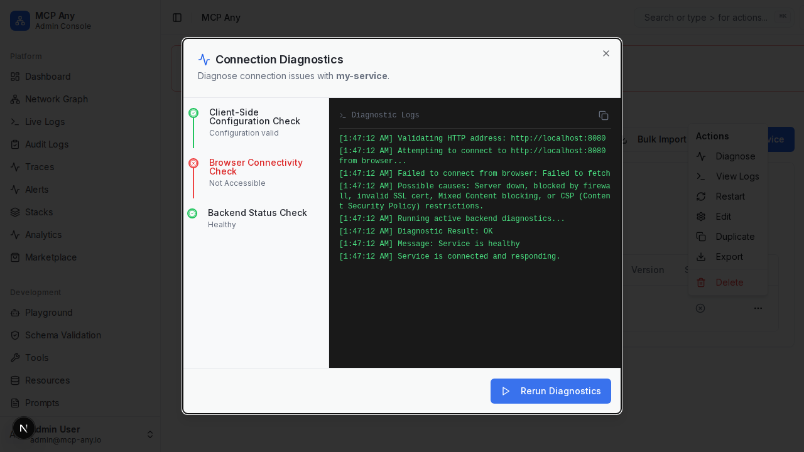

# Connection Doctor (Diagnostics)

The **Connection Doctor** provides real-time, interactive diagnostics for upstream services. It helps users troubleshoot connectivity issues, authentication failures, and configuration errors by running active checks against the backend.

## Features

- **Configuration Validation**: Checks if the service configuration (URL, command, etc.) is valid client-side.
- **Browser Connectivity**: Verifies if the service is reachable from the browser (useful for CORS, firewall, and mixed-content issues).
- **Backend Diagnostics**: Triggers a server-side diagnostic check (`doctor.CheckService`) that attempts to connect to the service from the MCP Any server container/process.
- **Detailed Logs**: Shows a step-by-step log of the diagnostic process.
- **AI-Powered Analysis**: Analyzes error messages to provide actionable suggestions (e.g., "Check firewall settings" for timeouts).

## Usage

1.  Navigate to the **Services** page.
2.  Click the **Alert/Warning** icon next to a failing service, or select **Diagnose** from the actions menu.
3.  Click **Start Diagnostics**.
4.  Review the steps and logs.

## Screenshot

