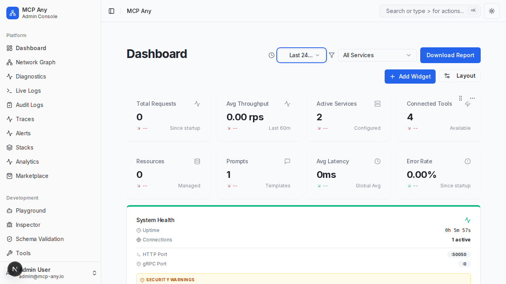

# Dashboard Time Range Filter

## Overview
The **Dashboard Time Range Filter** allows administrators to analyze system traffic and performance over varying time windows. Users can switch between 1 hour, 6 hours, 12 hours, and 24 hours views to correlate metrics with recent events or longer-term trends.

## Features
- **Dynamic Time Windows**: Select from 1h, 6h, 12h, or 24h ranges.
- **Context-Aware Metrics**: The "Request Volume" chart automatically updates to show data points corresponding to the selected duration.
- **Global Context**: The selection persists across dashboard widgets that support time-based filtering.

## Visuals

