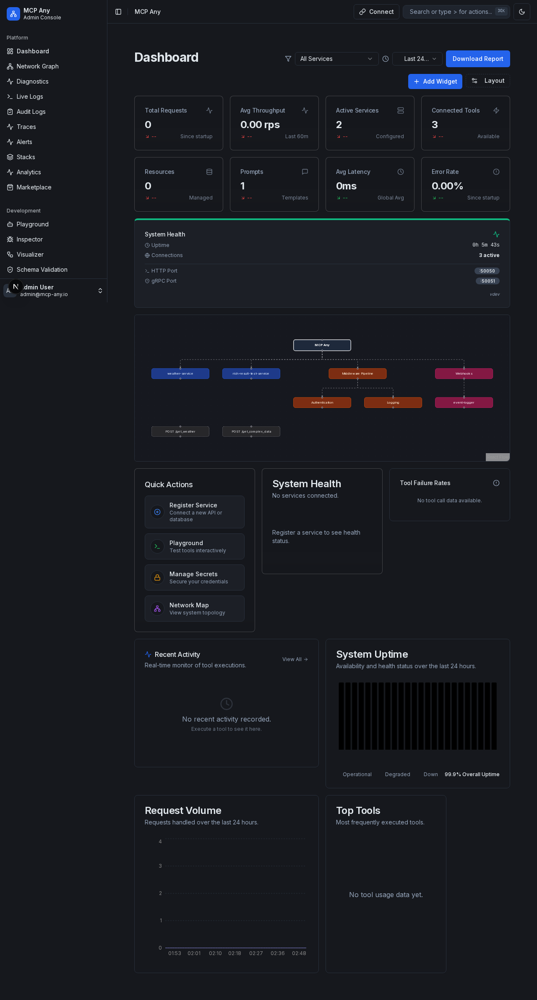
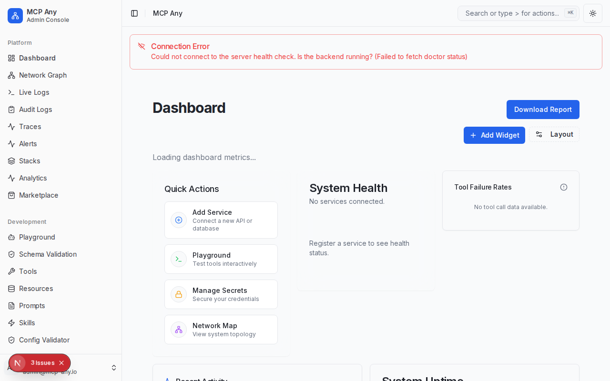

# System Dashboard

**Status:** Implemented

## Goal
Assess the overall health and performance of the MCP ecosystem. The Dashboard serves as the landing page, providing immediate visibility into key metrics and system status.

## Usage Guide

### 1. Overview
Navigate to `/` (Home).
The dashboard is composed of configurable widgets that provide visibility into different aspects of the system.

### 2. Live Metrics
The dashboard updates in real-time.
- **Total Requests**: Aggregate count of all operations processed.
- **Active Services**: Number of services currently in "Healthy" state.
- **Error Rate**: Percentage of requests resulting in failures.

### 3. Customizable Layout (Widget Gallery)
The dashboard features a fully customizable layout engine ("Portainer-style").

- **Add Widgets**: Click the **Add Widget** button to open the "Add Widget" sheet and choose from a library of available widgets (e.g., Metrics Overview, Recent Activity, Service Health, Tool Failure Rate).
- **Drag & Drop**: Freely rearrange widgets on the grid.
- **Resize**: Click the menu (⋮) on any widget to change its size (Full Width, 1/2, 1/3, etc.).
- **Persisted State**: Your custom layout is automatically saved to your local browser storage.

### 4. Quick Actions
The **Quick Actions** widget provides one-click access to the most common management tasks, helping new users get started and power users navigate efficiently.

- **Add Service**: Connect a new API, database, or agent.
- **Playground**: Interactively test tools.
- **Manage Secrets**: Securely store API keys.
- **Network Map**: Visualize the system topology.

